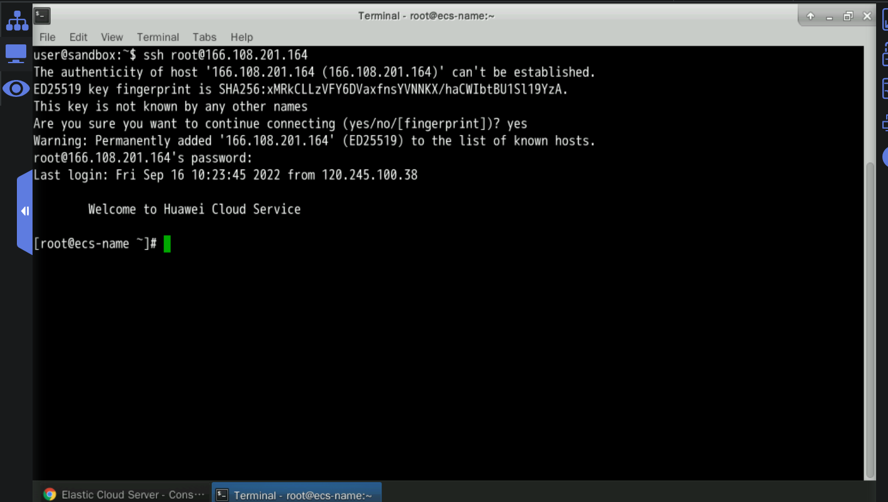

# HDFS Data and Files（CRUD）
This exercise describes how to use the command-line interface (CLI) provided by Hadoop to add, delete, modify, and query HDFS data and files

## The whole interface:


## 1 Prerequisites: Log in to HUAWEI CLOUD.


## 2 Presetting the Lab EnvironmentPrerequisites: Click Preset Lab Environment on the top of the sandbox.
Click Preset Lab Environment on the top of the sandbox.


After the presetting is successful, enter the Experiment Operation Desktop on the right.


## 3 Procedure
### 3.1 Logging in to the ECS using SSHOpen Google Chrome, go to the ECS service list, and copy the ECS EIP.

Go to the ECS service list, and copy the ECS EIP.

Get the public IP address of the machine

Double-click Xfce Terminal on the desktop. Log in to the ECS. The operations are as follows:Run the following command to log in to the ECS. Replace EIP in the command with the public IP address of the ECS.

Connection here suceeded

Here the credentials:


### 3.2 Starting the Hadoop clusterTo start the Hadoop cluster, perform the following steps:

Switch to user zker.


Run the following command to start Hadoop:
```
start-all.sh
```


Check all the process running well
```
jps
```


### 3.3 Creating a directory for storing data in HDFS
In the current Xfce terminal window, ensure that the current user is zker and run the following commands to create a directory:

```
hdfs dfs -mkdir /exp1
hdfs dfs -mkdir /exp1/text1
```

### 3.4 Downloading test data from OBS to a local host
The download URL of the test data is as follows:
[user_tag_value](https://koolabsfiles.obs.ap-southeast-3.myhuaweicloud.com/bigdata/user_tag_value)
[score](https://koolabsfiles.obs.ap-southeast-3.myhuaweicloud.com/bigdata/score)


### 3.5 Uploading the test data file to the remote ECS:
open a new Xfce terminal on the sandbox desktop, and run the following commands to download test data files score and user_tag_value to the remote ECS.


### 3.6 Adding files
1)Uploading data to a specified HDFS directory
Change the owner and user group of files score and user_tag_value in the /root directory to zker.


Move the two files to the /home/zker directory.


Switch to user zker, Upload these files to a specified HDFS directory
```
su - zker
hdfs dfs -put /home/zker/score /exp1
hdfs dfs -put /home/zker/user_tag_value /exp1/text1
hdfs dfs -cat /exp1/score | head -10 |tee /home/zker/result.txt

```


2)hdfs dfs -cat /exp1/text1/user_tag_value |head -10|tee /home/zker/result2.txt

### 3.7 Querying files:
check the files in the /exp1 directory and its subdirectories in HDFS as user zker.
```
hdfs dfs -ls /exp1
```


Recursively view all files in the /exp1 directory (-R is a recursive command).
```
hdfs dfs -ls -R /exp1
```


Run the cat command to view the first 10 lines of the file.
```
hdfs dfs -cat /exp1/score |head -10
```


Download the score file from the exp1 directory to the local host.
```
hdfs dfs -get /exp1/score /home/zker/score_1
```


```
hdfs dfs -cat /exp1/score | tail -10 |tee /home/zker/result3.txt
```


### 3.8 Deleting files
1)Run the following commands to delete the score file from the exp1 directory:
```
hdfs dfs -rm /exp1/score
hdfs dfs -ls /exp1|tee /home/zker/result8.txt

```


2)Recursively delete all files in the /exp1/text2 directory.
```
hdfs dfs -mkdir /exp1/text2
hdfs dfs -ls -R /exp1
hdfs dfs -rm -R /exp1/text2
hdfs dfs -ls -R /exp1
```


### 3.9 Moving files

Copy the user_tag_value file in the exp1/text1 directory to the exp1 directory.

```
hdfs dfs -cp /exp1/text1/user_tag_value /exp1
```


Move the user_tag_value file from the exp1 directory to the exp1/text2 directory.

Because the text2 folder has been deleted, create folder text2, move the user_tag_value file to the text2 folder.
```
hdfs dfs -mkdir /exp1/text2
hdfs dfs -mv /exp1/user_tag_value /exp1/text2
hdfs dfs -ls -R /exp1

```
