# Hive Data Query
>Use the Hive component to create a data warehouse and load data. Specifically, create a database in Hive and then create a table.
## 1 Preparing the Environment

### Presetting the Lab Environment
Before you start, go to the Tutorials tab and click Preset Lab.

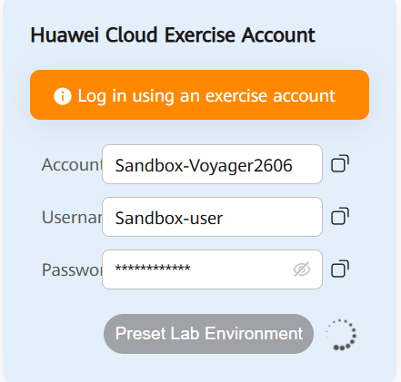

### Logging In to Huawei Cloud
Go to the Exercise Interface and open the Chrome browser. The Huawei Cloud console can be automatically logged in for the first time.

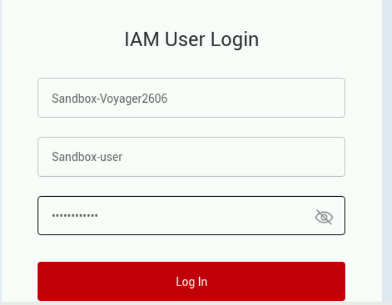

## 2 Procedure

### 1. Starting the Xfce terminal and log in to the ECS using SSH
#### 1.1 Open Google Chrome, go to the ECS service list, and copy the ECS EIP.

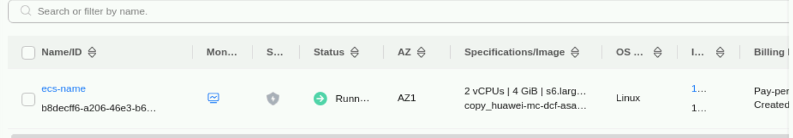

#### 1.2 Double-click Xfce Terminal on the desktop. Log in to the ECS. The operations are as follows:

Run the following command to log in to the ECS. Replace EIP in the command with the public IP address of the ECS.


#### 1.3 If this is your first time logging in to the system, a message is displayed. Enter yes.

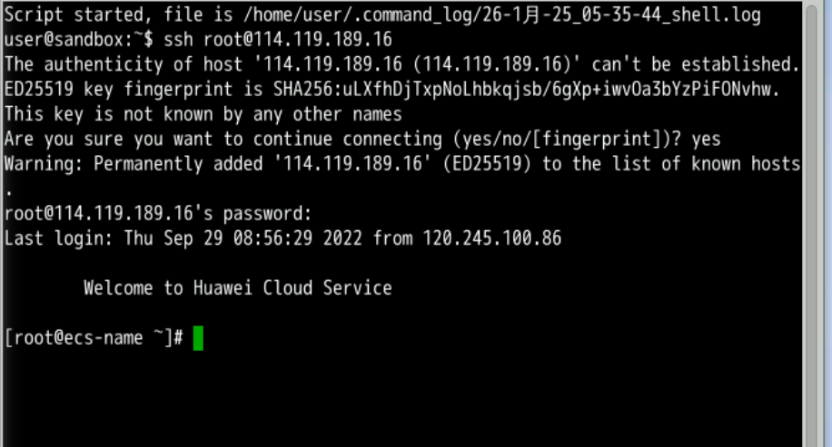

Now, you have logged in to the ECS.

### 2 Starting the Hadoop cluster
To start the Hadoop cluster, perform the following steps:

#### 2.1 Run the following command to switch to the zker user:

```                           
su - zker
```

#### 2.2 Find the start-cluster.sh file in the default path.
Run the following command to start the cluster environment:

```
./start-cluster.sh
```

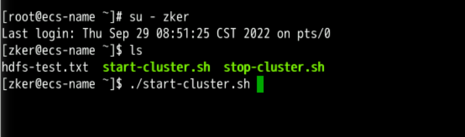

#### 2.3 Run the jps command. If the following eight processes are displayed, the Hadoop cluster is successfully started: HBase, ZooKeeper, HDFS, and Yarn are also started.


>[!Note]
>If not all the preceding processes are displayed, for example, HMaster and HRegionServer processes are missing, Hadoop fails to be started. In this case, repeat the preceding steps and run the jps command again to view the processes in the results.

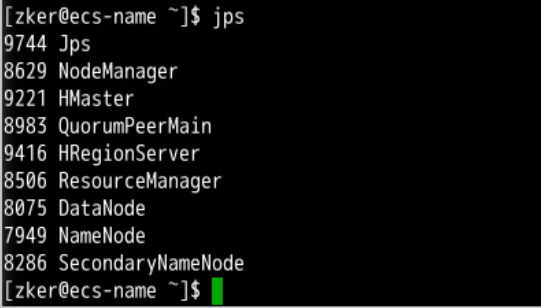

### 3. Preparing data
#### 3.1 Run the following command to switch to user zker (skip this step if you are):

```                             
su - zker
```

#### 3.2 Run the following commands to obtain data compression files: user_tag_value.zip, moc_course.zip, and moc_score.zip.
```                                
wget -O user_tag_value https://koolabsfiles.obs.ap-southeast-3.myhuaweicloud.com/bigdata/user_tag_value
wget -O moc_course https://koolabsfiles.obs.ap-southeast-3.myhuaweicloud.com/bigdata/moc_course
wget -O moc_score https://koolabsfiles.obs.ap-southeast-3.myhuaweicloud.com/bigdata/score
```

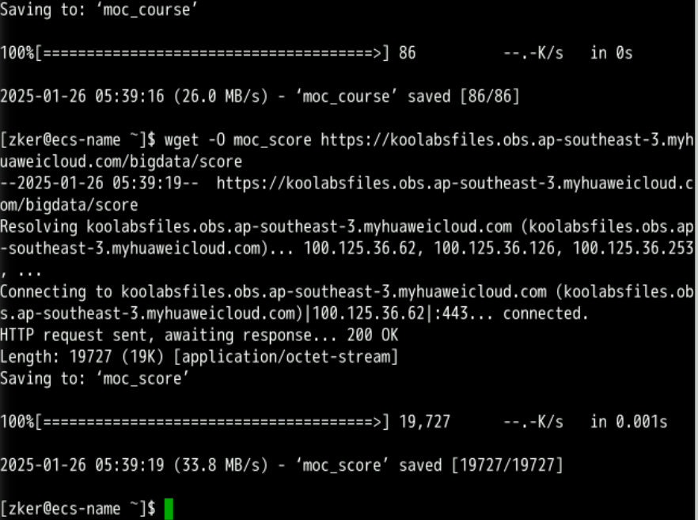

The following is an example of the user_tag_value file, which includes user and course information:
```                                
1035 Amy guian 2022/8/4 704
1843 Mikayla guian 2023/2/12 703
1228 Yasir kaifeng 2021/12/17 703
1496 Echo zhuhai 2022/11/12 703
1142 Roth changsha 2022/4/20 705
1058 Sage shanghai 2023/1/11 704
1290 Kylee chonqing 2021/5/15 701
1347 Brenden chonqing 2022/8/28 704
1397 Connor nanjing 2023/3/1 705
1378 Hollee shanghai 2021/6/2 701
1195 Stewart yichang 2022/1/5 702
1725 Rhoda beibeijing 2022/4/18 702
1253 Veronica nanjing 2021/9/3 702
1657 Alexa shenzhen 2022/9/19 703
1124 Amelia nanjing 2021/7/21 704
1043 Jorden wuhan 2022/9/17 702
2000 Benjamin guangzhou 2022/8/7 701
1086 Aspen chengdu 2023/1/29 701
1124 Michelle changsha 2021/3/29 701
1307 Craig hangzhou 2022/1/3 705
```
                            
The following is an example of the moc_course file, which contains course data:

```                             
701 computer 5h 0
702 politics 1h 0
703 math 6h 2
704 statuary 2h 1
705 literature 2 1h
```
                            
The following is an example of the moc_score file, which contains score data:

```                             
1074 Holmes 702 68
1323 Prescott 705 57
1847 Yolanda 705 52
1489 Brynn 701 69
1016 Kirk 703 61
```
                            
#### 3.3 Run the ls command to check whether these data files have been downloaded to the default path:

```
ls
```

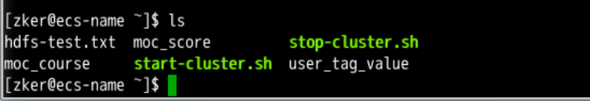

#### 3.4 Switch to the root user.

```                        
su - root
```
                            
#### 3.5 Create the data folder in the /opt/ directory to store datasets on the ECS. Check whether the data folder is successfully created.

```                           
mkdir /opt/data/
ls /opt/
```
                            
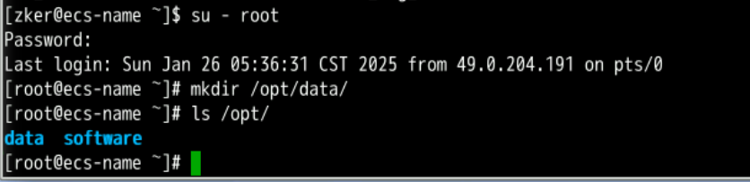

#### 3.6 Run the following command to move the three data files from the current path to the /opt/data path:

```                           
mv /home/zker/moc_*  /opt/data/
```
                            
```                             
mv /home/zker/user_tag_value  /opt/data/
```

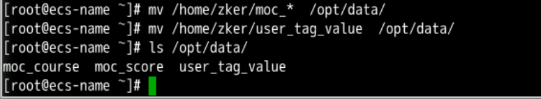

#### 3.7 Run the following command to verify that the three data files have been moved to the data directory. If the following information is displayed, the operation is successful:

```                           
ls /opt/data/
```


### 4. Starting the Hive client
#### 4.1 Run the following commands to switch to user zker and go to the Hive client directory:

```                           
su - zker
cd /usr/local/bigdata/apache-hive-3.1.2-bin/bin
ls
```

#### 4.2 Run the hive command to enter the Hive client:

```                           
hive
```

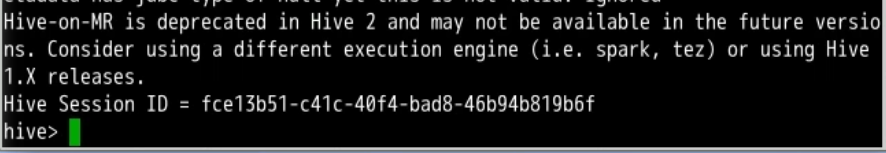

#### 4.5 Importing and querying data in a Hive database
##### 4.5.1 Basic database operations
###### A. View databases.

```           
show databases;
```

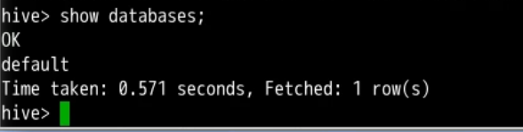

The following query result shows that there is only the default database.

###### B. Create database onlinelearning. The command format is create database Database name.

```                         
create database onlinelearning;
show databases;
```

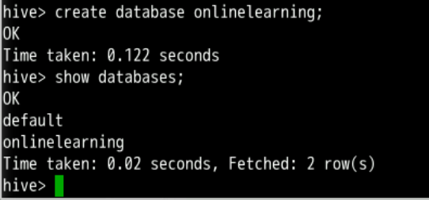

###### C. Run the use Database name command to work with the onlinelearning database:

```                         
use onlinelearning;
```

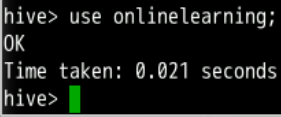

##### 4.5.2 Creating a table
Create external tables user_tag_value, moc_course, and moc_score in the onlinelearning database.

###### 1. Run the following command to create the user_tag_value table for user and course data:

```                         
CREATE EXTERNAL TABLE user_tag_value
(
userid STRING, 
username STRING, 
district STRING, 
last_login_time STRING, 
course_id STRING
)ROW FORMAT DELIMITED FIELDS TERMINATED BY ' '
LINES TERMINATED BY '\n'
STORED AS TEXTFILE;
```

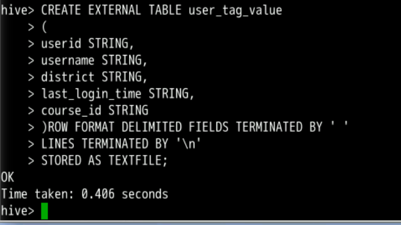

If OK is displayed in the result, the table is created. You can view the structure of the table.

###### 2. Run the following command to create the moc_course table for course data:

```                         
CREATE EXTERNAL TABLE moc_course
(
id STRING, 
name STRING,  
course_load STRING,
previous_course STRING
)ROW FORMAT DELIMITED FIELDS TERMINATED BY ' '
LINES TERMINATED BY '\n'
STORED AS TEXTFILE;
```

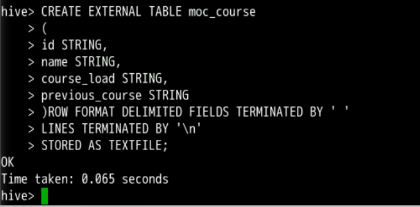

If OK is displayed in the result, the table is created.

###### 3. Run the following command to create the moc_score table for score data:

```                                
CREATE EXTERNAL TABLE moc_score
(
userid STRING, 
username STRING,
course_id STRING,
score STRING
)ROW FORMAT DELIMITED FIELDS TERMINATED BY ' '
LINES TERMINATED BY '\n'
STORED AS TEXTFILE;
```

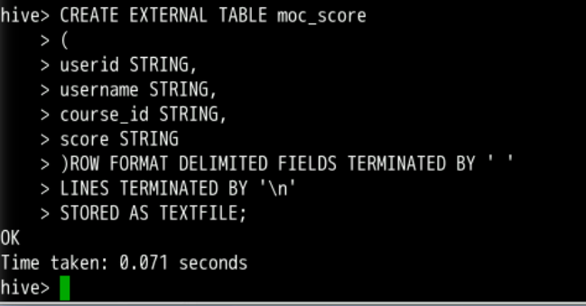

###### 4. Three tables user_tag_value, moc_course, and moc_score are created in the onlinelearning database. Run the following command to view the tables:

```                          
show tables;
```

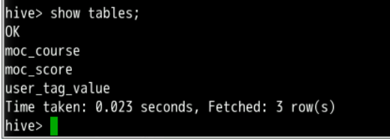

##### 4.5.3 Importing data to Hive tables
Import the three files in the /opt/data/ directory on the local server to the corresponding Hive tables.

###### 1. Run the following command to import the local data set /opt/data/user_tag_value/ to the user_tag_value table:

```                         
load data local inpath '/opt/data/user_tag_value/' overwrite into table user_tag_value;
```

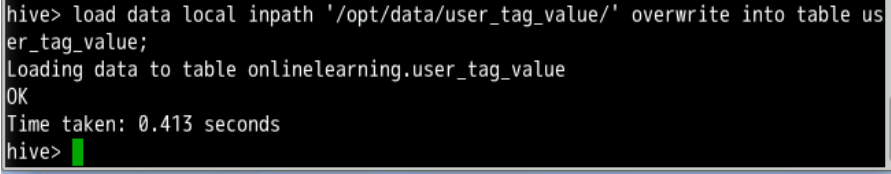

###### 2. Run the following statement to verify that data has been imported to the table:

```                         
select * from user_tag_value limit 10;
```

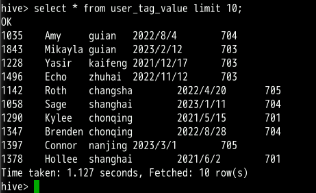

###### 3. Run the following command to import the local dataset /opt/data/moc_course to the moc_course table:

```                         
load data local inpath '/opt/data/moc_course' overwrite into table moc_course;
```                         
###### 4. Run the following statement to verify that data has been imported to the table:

```                         
select * from moc_course limit 5;
```                         

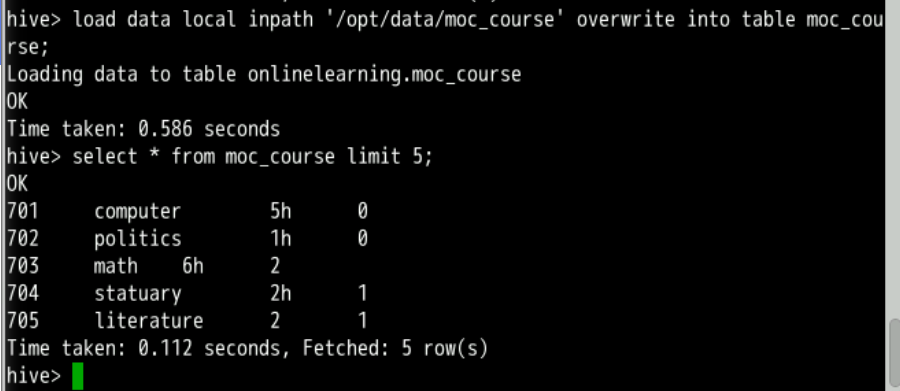

###### 5. Run the following command to import the local data set /opt/data/moc_score to the moc_score table:

```                         
load data local inpath '/opt/data/moc_score' overwrite into table moc_score;
```
                            
###### 6. Run the following statement to verify that data has been imported to the table:

```                         
select * from moc_score limit 5;
```

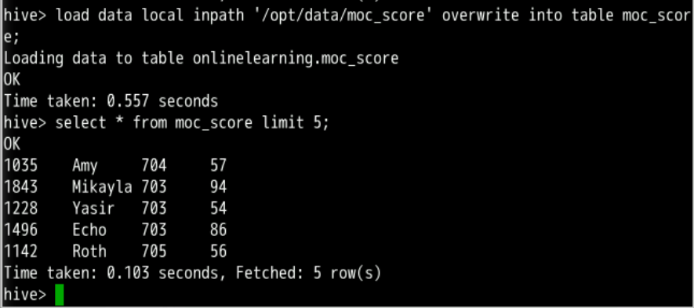

###### 5.4 Querying data
We can query data in a table or in multiple tables.

**1. Single table**

>A. Query the first 20 records in the moc_score table.

```               
select * from moc_score limit 20;
```
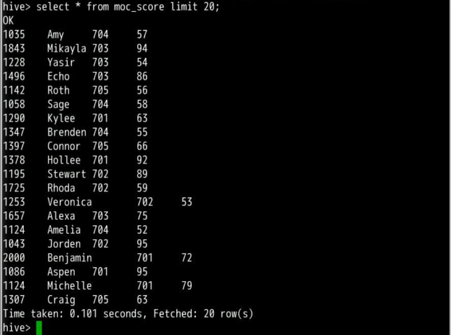


**a）Query the score of the user whose userid is 1442 in the moc_score table.**

```
select * from moc_score where userid='1442';
```
                            
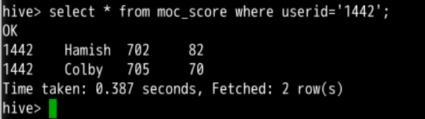

**2. Multiple tables**

Query information about "Wuhan" students who have selected course 7002 and scored no less than 90.

```            
select * from user_tag_value A,
(select userid,course_id, score from moc_score 
where course_id = '702' and score >= '90') as B
where A.userid=B.userid
and A.district like 'wuhan%' limit 10;
```
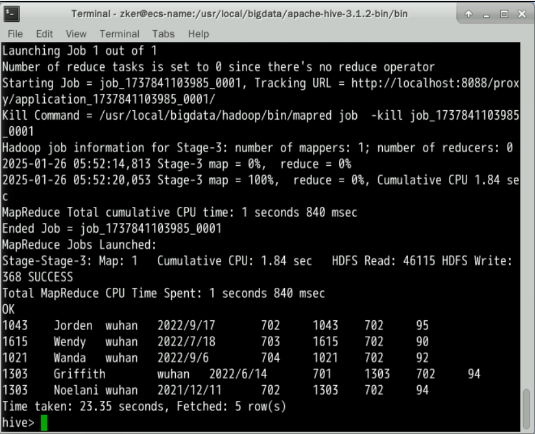

