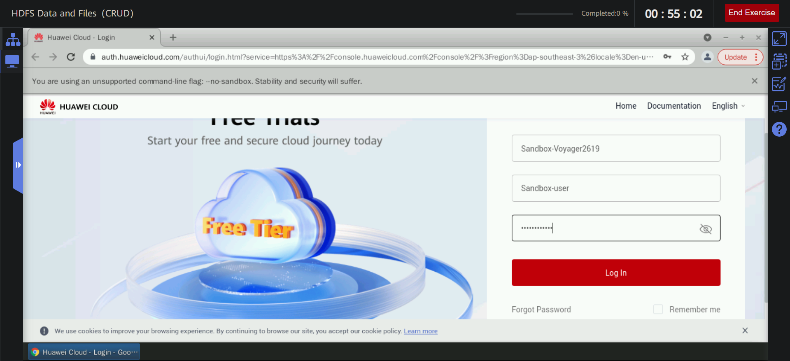
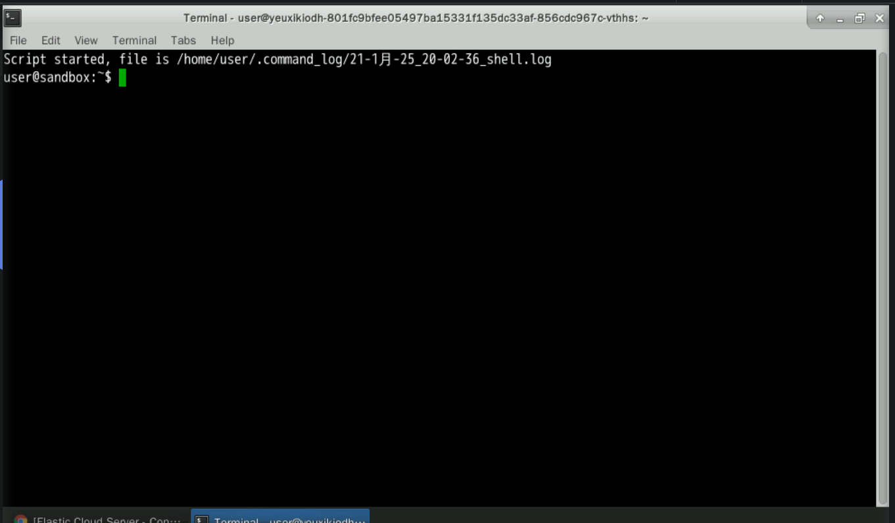
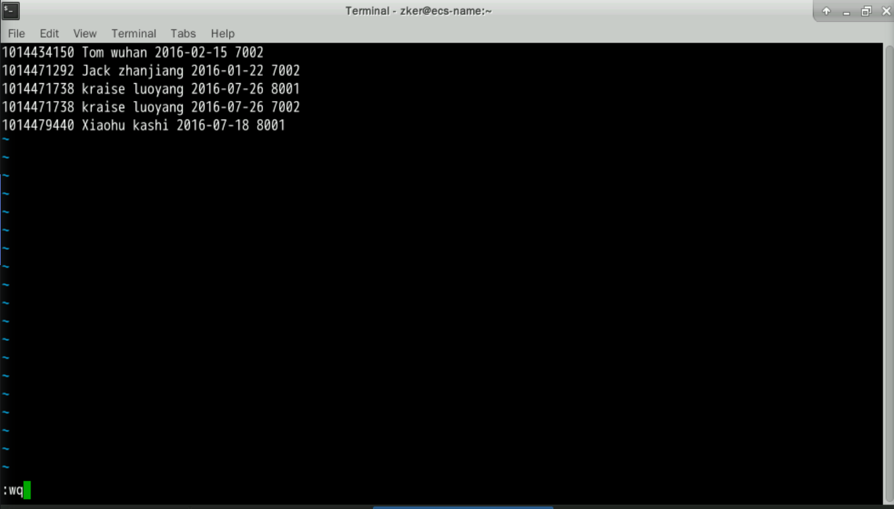

# HDFS File Write
This exercise describes how to use Python to upload local data to a specified HDFS directory.

## The whole interface:


## Prerequisites: Log in to HUAWEI CLOUD.



## 1 Presetting the Lab EnvironmentPrerequisites: Click Preset Lab Environment on the top of the sandbox.
Click Preset Lab Environment on the top of the sandbox.


After the presetting is successful, enter the Experiment Operation Desktop on the right.


## 2 Procedure
### 2.1 Logging in to the ECS using SSHOpen Google Chrome, go to the ECS service list, and copy the ECS EIP.

Go to the ECS service list, and copy the ECS EIP.

Get the public IP address of the machine

Double-click Xfce Terminal on the desktop. Log in to the ECS. The operations are as follows:Run the following command to log in to the ECS. Replace EIP in the command with the public IP address of the ECS.

Connection here suceeded

Here the credentials:


### 2.2 Starting the Hadoop clusterTo start the Hadoop cluster, perform the following steps:

Switch to user zker.


Run the following command to start Hadoop:
```
start-all.sh
```


Check all the process running well
```
jps
```


### 2.3 Creating a directory for storing data in HDFS
Ensure that the current user is zker and run the following commands to create a directory:
```
hdfs dfs -mkdir /exp3
```


### 2.4 Installing required modules
Ensure that you have remotely logged in to the ECS and switched to user root.


Run the following command to install the pyhdfs module:
```
pip3 install pyhdfs
```


### 2.5 Downloading test data from OBS to a local host

The download URL of the test data is as follows:
[url](https://koolabsfiles.obs.ap-southeast-3.myhuaweicloud.com/bigdata/moc_course)


### 2.6 Uploading the test data file to the remote ECS

Upload the downloaded test data file /home/user/Downloads/moc_course to the remote ECS, open a new Xfce terminal on the sandbox desktop, and run the following command:


Use SSH to remotely log in to the ECS again, change the owner and user group of the moc_course file uploaded to the /root directory to zker.
Move the file to the /home/zker directory.


Switch to user zker and upload the moc_course file to the /exp3 directory of HDFS.
```
su - zker
hdfs dfs -put /home/zker/moc_course /exp3
hdfs dfs -ls /exp3
```


### 2.7 Writing Python Code
ensure that the current user is root, create python file called 'append_file' with vim:
```
vim append_file.py
```
Code 
```
import pyhdfs

if __name__=="__main__":
 fs=pyhdfs.HdfsClient(hosts="192.168.0.196:9870",user_name="zker")
 f=open("hello.txt",'r',encoding='utf-8')
 content=f.read().encode("utf-8").decode("latin1")
 f.close()
 fs.append("/exp3/moc_course",content)

```


### 2.8 Executing the Python code and viewing the
create the hello.txt file in the /root directory before code execution:
```
vim hello.txt
```
Copy the text into hello.txt
```
1014434150 Tom wuhan 2016-02-15 7002
1014471292 Jack zhanjiang 2016-01-22 7002
1014471738 kraise luoyang 2016-07-26 8001
1014471738 kraise luoyang 2016-07-26 7002
1014479440 Xiaohu kashi 2016-07-18 8001
```


Run the following commands in the directory where append_file.py is located:
```
python3 append_file.py
```
```
su - zker
hdfs dfs -cat /exp3/moc_course | tail -5 | tee /home/zker/check03.txt
```
Switch to user zker and run the following command to check whether the content of the hello.txt file has been written to moc_course. You can run the tail command to check whether the content of the last five lines is the same as that of the hello.txt file. If they are the same, the content is correctly written.

