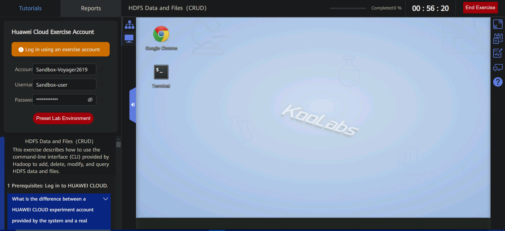
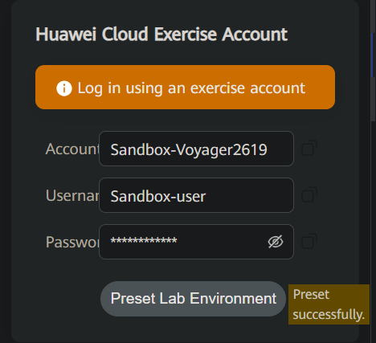
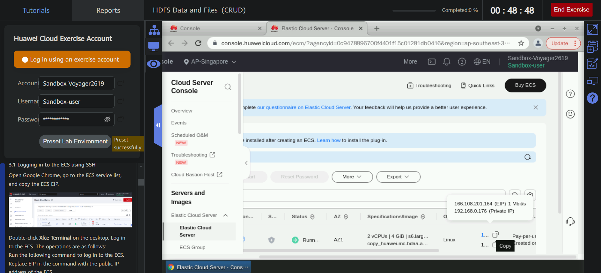

# HDFS File Read
This exercise describes how to use Python to read a specified HDFS file.

## The whole interface:


## Prerequisites: Log in to HUAWEI CLOUD.


## 1 Presetting the Lab EnvironmentPrerequisites: Click Preset Lab Environment on the top of the sandbox.
Click Preset Lab Environment on the top of the sandbox.


After the presetting is successful, enter the Experiment Operation Desktop on the right.


## 2 Procedure
### 2.1 Logging in to the ECS using SSHOpen Google Chrome, go to the ECS service list, and copy the ECS EIP.

Go to the ECS service list, and copy the ECS EIP.

Get the public IP address of the machine

Double-click Xfce Terminal on the desktop. Log in to the ECS. The operations are as follows:Run the following command to log in to the ECS. Replace EIP in the command with the public IP address of the ECS.

Connection here suceeded

Here the credentials:


### 2.2 Starting the Hadoop clusterTo start the Hadoop cluster, perform the following steps:

Switch to user zker.


Run the following command to start Hadoop:
```
start-all.sh
```


Check all the process running well
```
jps
```


### 2.3 Creating a directory for storing data in HDFS
Ensure that the current user is zker and run the following commands to create a directory:
``` hdfs dfs -mkdir /exp3 ```

### 2.4 Installing required modules
Ensure that you have remotely logged in to the ECS and switched to user root.
```
su - root
pip3 install pyhdfs
```


### 2.5 Downloading test data from OBS to a local

The download URL of the test data is as follows:
[user_tag_value](https://koolabsfiles.obs.ap-southeast-3.myhuaweicloud.com/bigdata/user_tag_value)


The data file name is user_tag_value. Remember the file path (/home/user/Downloads/) 

### 2.6 Uploading the test data file to the remote ECS and HDFS

Upload the downloaded test data file /home/user/Downloads/user_tag_value to the remote ECS, open a new Xfce terminal on the sandbox desktop, and run the following command:


Use SSH to remotely log in to the ECS again, change the owner and user group of the user_tag_value file uploaded to the /root directory to zker.
```
ssh root@EIP
chown zker:zker user_tag_value
ll
```


Move the file to the /home/zker directory.

```
mv user_tag_value /home/zker/
ls /home/zker/
```


Switch to the zker user.
``` su - zker ```
Upload the user_tag_value file to the /exp3 directory of HDFS.
``` hdfs dfs -put /home/zker/user_tag_value /exp3 ```


### 2.7 Writing Python code

In the current Xfce terminal window, ensure that the current user is root, and run the following commands to use the Vim text editor to create the read_file.py file in the /root directory:

```
vim read_file.py
```
>[!CAUTION]
>This code reads and displays the first five lines of the /exp3/user_tag_value file in HDFS. 192.168.0.196 indicates the internal IP address of the ECS,
>It should be changed to your the internal IP address of the ECS

Code of read_file.py
```
import pyhdfs
if __name__=="__main__":
        fs=pyhdfs.HdfsClient(hosts="192.168.0.196:9870",user_name="zker")
        lineindex=5
        with fs.open("/exp3/user_tag_value") as ctx:
                for i in range(lineindex):
                        print(ctx.readline().decode("utf-8"))
                        i += 1
                        if i >= lineindex:
                                ctx.close()
```


### 2.8 Executing the Python code and viewing the result

In the current Xfce terminal window, run the following command in the /root directory where read_file.py is stored as user root:

```
python3 read_file.py | tee check02.txt

```


