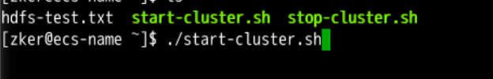
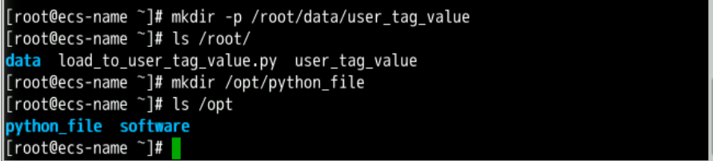
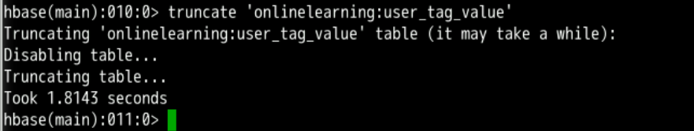
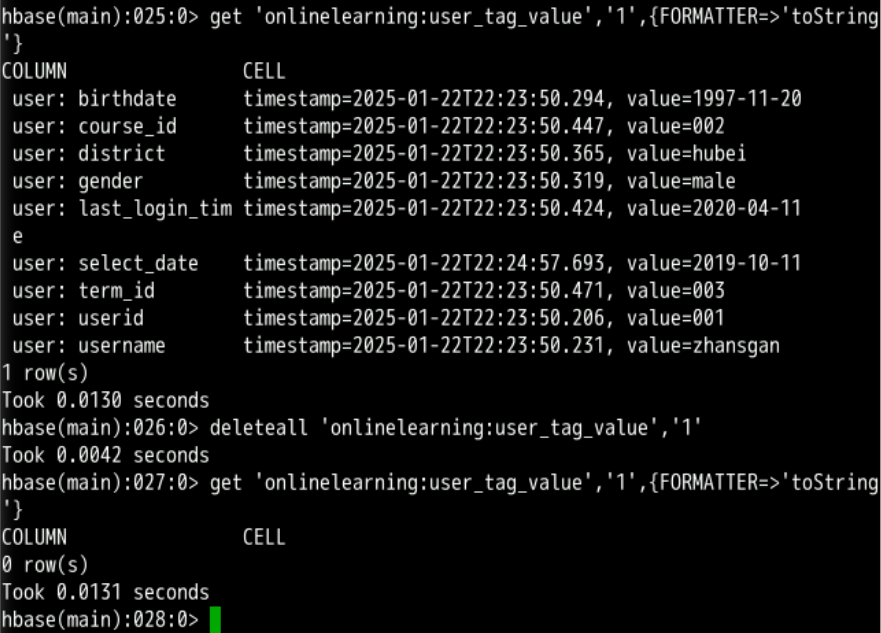

# Basic Operations on HBase Data
This exercise describes how to use HBase Shell commands to create, delete, modify the user_tag_value table, as well as add, delete, query, and modify table data.

## 1 Presetting the Lab Environment
Click Preset Lab Environment on the top of the sandbox.


## 2 Starting the Xfce terminal and logging in to the ECS using SSH

Open Google Chrome, go to the ECS service list, and copy the ECS EIP.


Double-click Xfce Terminal on the desktop. Log in to the ECS
```
ssh root@EIP

```


## 3 Starting the Hadoop cluster

Switch to user zker.

``` su - zker ```


Find start-cluster.sh and execute it.



Run jps to check whether all processes are executed.


>![CAUTION]
>If not all the preceding processes are displayed, for example, HMaster and HRegionServer processes are missing, HBase fails >to be started. In this case, you need to manually start HBase.

```
cd /usr/local/bigdata/hbase-2.3.4/bin
./start-hbase.sh
```
## 4 Preparing Data

Log in to the ECS and enter the ECS login password as user root.


Download the data file.
```
wget https://koolabsfiles.obs.ap-southeast-3.myhuaweicloud.com/bigdata/user_tag_value
```


Downloading code files
```wget https://sandbox-expriment-files.obs.cn-north-1.myhuaweicloud.com:443/20220930/exp5/load_to_user_tag_value.py
```


Create the data folder in the /root/ directory to store data sets and run the ls command to view the data sets.
```
mkdir -p /root/data/user_tag_value
ls /root/
mkdir /opt/python_file
ls /opt
```


Move the downloaded data file to the /root/data directory,then
Move the downloaded code file to the /opt/python_file directory.
```
mv user_tag_value /root/data/user_tag_value/
mv load_to_user_tag_value.py /opt/python_file
```


## Procedure
### 5.1 Operations on HBase database tables
Starting the HBase clientLoad HBase environment variables.
``` source /etc/profile ```
Then, start HBase client by :
```
hbase shell
```

### 5.2 Creating the user_tag_value table
```
create_namespace 'onlinelearning'
create 'onlinelearning:user_tag_value',{NAME=>'user'}
```
Run the ```list``` command to check whether the tablespace and table are created.


### 5.3 Modifying the table structure (change the value of VERSIONS from 1 to 3)
Run the describe command to view the table structure after a table is created.
``` 
describe 'onlinelearning:user_tag_value'
```


Enter the alter command to change the structure of an existing table.
```
alter 'onlinelearning:user_tag_value', NAME => 'user', VERSIONS => 3
```

Run describe command.
```
describe 'onlinelearning:user_tag_value'
```


### 5.4 Starting HBase Thrift
Retain the existing Xfce terminal, open another Xfce terminal, and run the ssh root@EIP command to log in to the ECS. Run the following command to start HBase Thrift.


``` hbase thrift start-port:9090 ```


## 6 Uploading a file
Open a third terminal use ssh to login to root, then install thrift.
```
pip3 install thrift
```


Install the hbase-thrift-0.20.4.patch (supporting Python 3.x).
```
wget http://dl.cpp.la/Archive/hbase-thrift-0.20.4.patch.tgz
```


>![CAUTION]
>If did not downloaded the file add ```--no-check-certificate ``` at the  end of the command.


Decompress the package.
Switch the path.
```
tar -zxvf hbase-thrift-0.20.4.patch.tgz
cd hbase-thrift-0.20.4.patch
```

Install the setup.py file.

```
python3 setup.py install
```


Check whether hbase-thrift is installed.
``` pip3 list | grep hbase-thrift ```


Run the following Python script to upload the data sets in user_tag_value to HBase table user_tag_value:
```
python3 /opt/python_file/load_to_user_tag_value.py
```


Checking the first five rows of data in user_tag_valueUse the first Xfce terminal, run the scan command to query the entire table data. You only need to specify the table name.
```
scan 'onlinelearning:user_tag_value', {LIMIT=>5, FORMATTER=>'toString'}
```


The following figure shows the command output and the first five lines of data in user_tag_value.


Clearing data tablesRun the truncate command to clear all data in a specified table.
```
truncate 'onlinelearning:user_tag_value'
```


Querying data whose rowkey is 1 in user_tag_value
``` get 'onlinelearning:user_tag_value', '1' ```


add the data whose rowkey is 1:
``` 
put 'onlinelearning:user_tag_value','1','user: userid','001'
put 'onlinelearning:user_tag_value','1','user: username','zhansgan'
put 'onlinelearning:user_tag_value','1','user: birthdate','1997-11-20'
put 'onlinelearning:user_tag_value','1','user: gender','male'
put 'onlinelearning:user_tag_value','1','user: district','hubei'
put 'onlinelearning:user_tag_value','1','user: last_login_time','2020-04-11 '
put 'onlinelearning:user_tag_value','1','user: course_id','002'
put 'onlinelearning:user_tag_value','1','user: term_id','003'
put 'onlinelearning:user_tag_value','1','user: select_date','2019-09-07'
```


Querying data whose rowkey is 1
``` get 'onlinelearning:user_tag_value','1',{FORMATTER=>'toString'} ```


Modifying dataRun the following commands to change select_data (course selection time) to 2019-10-11 and check the data before and after the modification:
``` get 'onlinelearning:user_tag_value','1',{FORMATTER=>'toString'} ```


```put 'onlinelearning:user_tag_value','1','user: select_date','2019-10-11'```


``` get 'onlinelearning:user_tag_value','1',{FORMATTER=>'toString'} ```


Deleting data from user_tag_value:
Delete a logical row from the table. Run the deleteall command to delete the data whose rowkey is 1, and then check the data before and after the deletion.
```
get 'onlinelearning:user_tag_value','1',{FORMATTER=>'toString'}
deleteall 'onlinelearning:user_tag_value','1'
get 'onlinelearning:user_tag_value','1',{FORMATTER=>'toString'}
```


