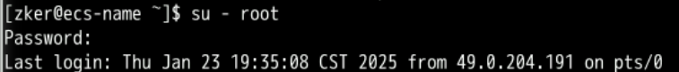
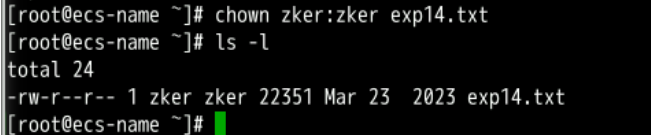
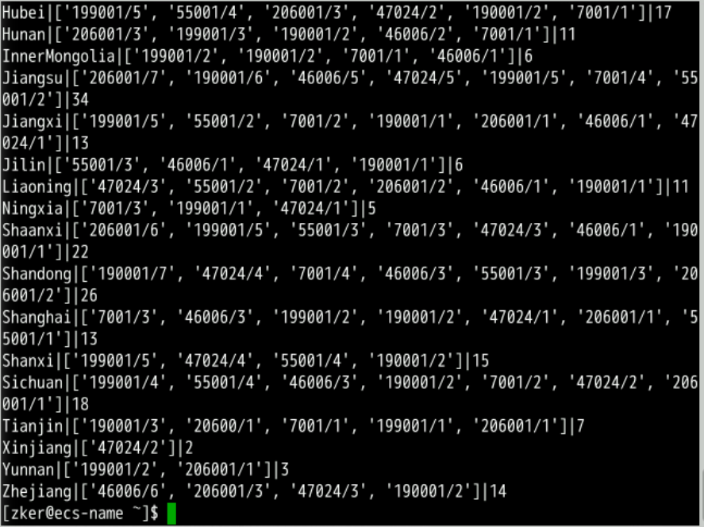

# 1 Configuring the Lab Environment
## 1.1 Prerequisites: Logging In to Huawei Cloud
Enter the exercise operation interface, open the browser, and go to the Huawei Cloud login page. Click IAM User. Then, use the account assigned to you to log in to Huawei Cloud.


>[!Note]
>Use the login credentials provided by the exercise tutorial. Do not use your own account credentials.
## 1.2 Presetting the Lab Environment
Click Preset Lab.


# 2 Procedure
## 2.1 Logging in to the ECS using the Xfce terminal
### a- Open Google Chrome, go to the ECS service list page, and copy the ECS EIP.


### b- Double-click Xfce Terminal on the desktop and run the following command to log in to the ECS:

```                             
ssh root@EIP
```


### c- Replace EIP in the command with the one obtained in the previous step.
### d- Press Enter and obtain the password of user root. The following figure shows how to obtain the password.
### e- Paste the obtained password to the position shown in the following figure and press Enter to log in to the ECS.


>[!Note] 
>If this is your first time logging in to the ECS, a message is displayed after you press Enter. Enter yes and press Enter again.

You have logged in to the ECS using SSH.

## 2.2 Starting the Hadoop cluster
### a- Run the following command to switch to user zker:

```                              
su - zker
```

                      

### b- Run the following command to start Hadoop:

```                            
start-all.sh
```
                            
The command output is as follows.


### c- Run the following command to check whether the Hadoop is started successfully:

```                          
jps
```

                            
If the process is started, there are five processes in the command output as shown in the following figure.
Now, you have started the Hadoop cluster.

## 2.3 Creating a directory for storing data in the HDFS
In the Xfce terminal window, perform the following operations as user zker:
Run the following command to create a directory:

```
hdfs dfs -mkdir /exp14
```


### 2.4 Installing required modules

Log in to the ECS in the Xfce terminal window, switch to user root, and perform the following operations:

#### a- In the Xfce terminal window, run the following command to switch to user root: (Skip this step if you have logged in to the ECS as user root.)

```                             
su - root
```
Enter the password (masked by default) and press Enter. If the command output shown in the following figure is displayed, you have logged in to the ECS as user root.



#### b- Run the following command to install the pyhdfs module:
```                            
pip3 install pyhdfs
```


Now you have completed the installation of the pyhdfs module.

## 2.5 Downloading test data to the ECS and uploading the data to the HDFS
### a- Run the following commands to download the exp14.txt file to the ECS:

```                              
wget https://koolabsfiles.obs.ap-southeast-3.myhuaweicloud.com/bigdata/exp14.txt
```


                            
### b- Run the following command to view the file:                      

``` ls ```


#### c- Run the following command to change the owner and user group of the exp14.txt file (under the /root directory) to zker:

```                           
chown zker:zker exp14.txt
```                         
The command output is as follows.


### d- Run the following command to move the files to the /home/zker directory:
```
mv exp14.txt /home/zker/
```                         
The command output is as follows.


### e- Switch to the zker user and run the following commands to upload the exp14.txt file to the /exp14 directory in the HDFS:
```
su - zker                                                
hdfs dfs -put /home/zker/exp14.txt /exp14
hdfs dfs -ls /exp14
```                            
The command output is as follows.


The local test data has been uploaded to the ECS and HDFS.

## 2.6 Writing a Python program
In the Xfce terminal window, perform the following operations as user zker:

### a- Run the following command to create the district_mapper.py file in the /home/zker directory:

```                            
vim district_mapper.py
```
                            
Press i to enter editing mode and enter the following code:

```                             
import sys

for data in sys.stdin:
        data = data.replace('\\N',"NULL").strip()
        record = data.split('***')
        courseID = record[3]
        # Filter out null values.
        if courseID == r"NULL" or record[1] == r"NULL":continue
        # Extract province information
        if record[1].find('_') >=0: print("%s\t%s" % ((record[1].split('_'))[1], courseID))
        # Output information for other areas
        else: print("%d%s\t%s" % (0,record[1], courseID))
```

Press Esc and enter :wq to save modifications and exit the editing mode.


### b- Run the following command to open the district_reducer.py configuration file using the vim editor:

```                             
vim district_reducer.py
```
                            
### c- Press i to enter editing mode and enter the following code:

```                            
#!/usr/bin/python3

import sys

numBycourse = {}
list = []
lastKey = False
i = 0

for data in sys.stdin:
    data = data.strip()
    record = data.split('\t')
    curKey = record[0] # key
    courseID = record[1] # value
    if lastKey and curKey !=lastKey: 
        sortedID = sorted(numBycourse.items(),key=lambda d:d[1],reverse=True)
        for v in range(len(numBycourse)): list.append(str(sortedID[v][0])+'/'+str(sortedID[v][1]))
        sys.stdout.write("%s|%s|%s\n"%(lastKey,list,i))
        lastKey = curKey
        list = []
        i = 1
        numBycourse = {}
        numBycourse[courseID] = 1
    else: 
        lastKey = curKey
        if courseID in numBycourse: numBycourse[courseID] += 1
        else: numBycourse[courseID] = 1
        i += 1
if lastKey: 
    if courseID in numBycourse: numBycourse[courseID] += 1
    else: numBycourse[courseID] = 1
    i += 1
    sortedID = sorted(numBycourse.items(),key=lambda d:d[1],reverse=True)
    for v in range(len(numBycourse)): list.append(str(sortedID[v][0])+'/'+str(sortedID[v][1]))
    sys.stdout.write("%s|%s|%s\n"%(lastKey,list,i))
```
                            
Press Esc and enter :wq to save modifications and exit the editing mode.


>[!NOTE]
>You have finished coding.

## 2.7 Submitting the MapReduce code to the Hadoop cluster and viewing the result
In the Xfce terminal window, perform the following operations as user zker:
### a- Run the following commands to submit the code to Hadoop and execute the code:

```
hadoop jar /usr/local/bigdata/hadoop-3.2.2/share/hadoop/tools/lib/hadoop-streaming-3.2.2.jar -D stream.non.zero.exit.is.failure=false \
 -files "/home/zker/district_mapper.py","/home/zker/district_reducer.py" \
 -input "/exp14/exp14.txt" -output "/exp14/out14" \
 -mapper "python3 district_mapper.py" -reducer "python3 district_reducer.py"
```
                            
The command output is as follows.


### b- Check the execution result in the HDFS. The execution result has been exported to the part-00000 file, as shown in the following figure.

```                            
hdfs dfs -ls /exp14
```
                         
Run the following command to check the file content:


```                                
hdfs dfs -cat /exp14/out14/part-* | tee checktest.txt
```
                            
The following figure shows the expected result.


>[!NOTE]
>Now, all steps are completed of this lab.