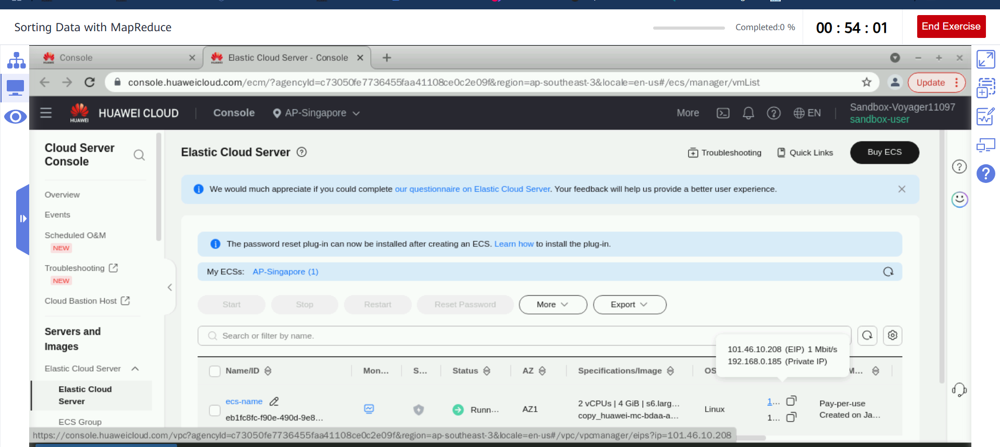

# Sorting Data with MapReduce
Execute a Python script to call MapReduce and collect statistics on the number of users in different regions and the courses they selected.

# 1 Presetting the Lab Environment
Click Preset Lab.


# 2 Procedure
## 2.1 Logging in to the ECS using the Xfce terminal
### a- Open Google Chrome, go to the ECS service list page, and copy the ECS EIP.


### b- Double-click Xfce Terminal on the desktop and run the following command to log in to the ECS:

```                            
ssh root@EIP
```
                         
### c- Replace EIP in the command with the one obtained in the previous step.

### d- Press Enter and obtain the password of user root. The following figure shows how to obtain the password.

### e- Paste the obtained password to the position shown in the following figure and press Enter to log in to the ECS.

>[!Important]
>If this is your first time logging in to the ECS, a message is displayed after you press Enter. Enter yes and press Enter again.


>[!Note]
>You have logged in to the ECS using SSH.

## 2.2 Starting the Hadoop cluster
### a- Run the following command to switch to user zker:

```                            
su - zker
```


### b- Run the following command to start Hadoop:

```                            
start-all.sh
```

The command output is as follows.


### c- Run the following command to check whether the Hadoop is started successfully:

```                            
jps
```


## 2.3 Creating a directory for storing data in the HDFS
In the Xfce terminal window, perform the following operations as user zker:

Run the following command to create a directory:

```                 
hdfs dfs -mkdir /exp13
```

               

## 2.4 Installing required modules
Log in to the ECS in the Xfce terminal window, switch to user root, and perform the following operations:

### a- In the Xfce terminal window, run the following command to switch to user root: (Skip this step if you have logged in to the ECS as user root.)

```                               
su - root
```
                            
Enter the password (masked by default) and press Enter. If the command output shown in the following figure is displayed, you have logged in to the ECS as user root.


### b- Run the following command to install the pyhdfs module:

```                            
pip3 install pyhdfs
```
                         

## 2.5 Downloading test data to the ECS and uploading the data to the HDFS
### a- Run the following commands to download the exp13.txt file to the ECS:

```                             
wget https://koolabsfiles.obs.ap-southeast-3.myhuaweicloud.com/bigdata/exp13.txt
```


### b- Run the following command to view the file:
                           
``` ls ```


### c- Run the following command to change the owner and user group of the exp13.txt file (under the /root directory) to zker:

```                            
chown zker:zker exp13.txt
```


### d- Run the following command to move the files to the /home/zker directory:

```                            
mv exp13.txt /home/zker/
```


### e- Switch to the zker user and run the following commands to upload the exp13.txt file to the /exp13 directory in the HDFS:

```                            
hdfs dfs -put /home/zker/exp13.txt /exp13                                
hdfs dfs -ls /exp13
```

                            

The local test data has been uploaded to the ECS and HDFS.

## 2.6 Writing a Python program
In the Xfce terminal window, perform the following operations as user zker:

### a- Run the following command to create the avg_mapper.py file in the /home/zker directory:

```                       
vim avg_mapper.py
```
                            
Press i to enter editing mode and enter the following code:

```                              
import sys

for data in sys.stdin:
    data = data.replace('\\N',"NULL").strip()
    record = data.split('***')
    courseNum = record[0]
    area = (record[1].split('_'))[1]
    time = record[2] 
    new_courseNum = int(courseNum)
    print("%s\t%s\t%s" % (area, new_courseNum, time))
```

Press Esc and enter :wq to save modifications and exit the editing mode.


### b- Create the avg_reducer.py file, copy the following code to the file, and save:

```                         
vim   avg_reducer.py
```
                         
```                                
#!/usr/bin/python3

import sys

count=0
i=0
sum=0
for data in sys.stdin:  
    name, score, time = data.strip().split('\t')
    if i==0:    
       current_name=name
       i=1       
    try:  
       score = int(score)  
    except ValueError:   
        continue  
    if current_name == name:  
       count += 1
       sum +=score        
    else:  
       print('%s\t%s\t%s' % (current_name,count,sum/count))
       current_name=name
       sum=score
       count=1 
print('%s\t%s\t%s' % (current_name,count,sum/count))
```


## 2.7 Submitting the MapReduce code to the Hadoop cluster and viewing the result
In the Xfce terminal window, perform the following operations as user zker:

### a- Run the following commands to submit the code to Hadoop and execute the code:

```                               
hadoop jar /usr/local/bigdata/hadoop-3.2.2/share/hadoop/tools/lib/hadoop-streaming-3.2.2.jar -D stream.non.zero.exit.is.failure=false \
-files "/home/zker/avg_mapper.py","/home/zker/avg_reducer.py" \
-input "/exp13/exp13.txt" -output "/exp13/out13" \
-mapper "python3 avg_mapper.py" -reducer "python3 avg_reducer.py"
```
   

The command output is as follows.


### b- Check the execution result in the HDFS. The execution result has been exported to the part-00000 file, as shown in the following figure.

```                               
hdfs dfs -ls /exp13/out13
```


Run the following command to check the average value of the file content:

```                            
hdfs dfs -cat /exp13/out13/part-* | tee checktest.txt
```

