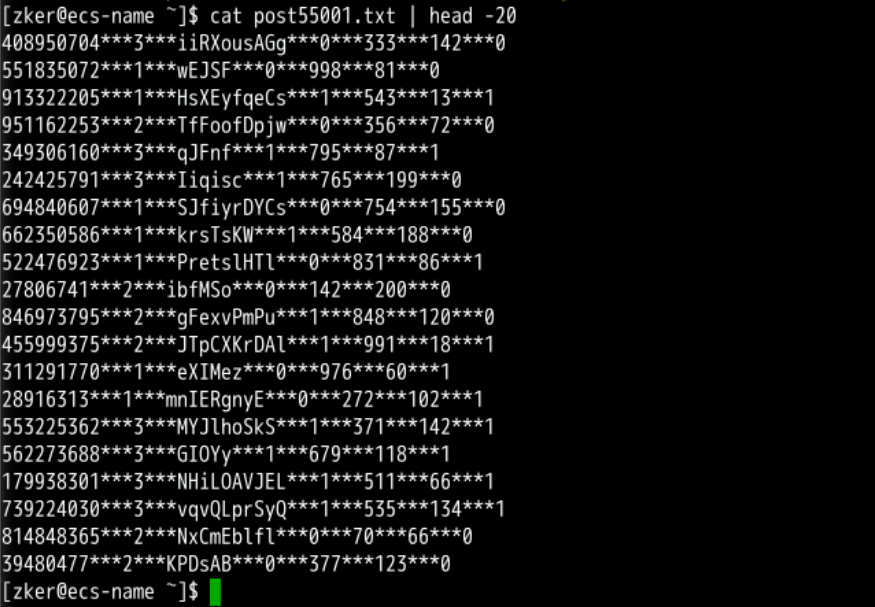

# Spark Correlation Analysis
This exercise uses Spark to analyze the correlation between data. Based on multiple course discussion tables, analyze the impact of interactive discussion between teachers and students on students' enthusiasm for participating in discussion. Specifically,

## 1 Configuring the Lab Environment
### 1.1 Prerequisites: Logging In to Huawei Cloud
Enter the exercise operation interface, open the browser, and go to the Huawei Cloud login page. Click IAM User. Then, use the account assigned to you to log in to Huawei Cloud.


### 1.2 Presetting the Lab Environment

Click Preset Lab.

## 2 Procedure
### 2.1 Starting the Xfce terminal and logging in to the ECS using SSH
Open Google Chrome, go to the ECS service list page, and copy the ECS EIP.


Double-click Xfce Terminal on the desktop. Log in to the ECS. The operations are as follows:

Run the following command to log in to the ECS. Replace EIP in the command with the public IP address of the ECS.

```                            
ssh root@EIP
```

If this is your first time logging in to the system, a message is displayed. Enter yes.
You can obtain the password of user root to log in to the ECS. The following figure shows you how to get the password.


### 2.2 Starting the Hadoop cluster
To start the Hadoop cluster, perform the following steps:

#### 2.2.1 Switching to user zker

```                           
su - zker
```
                          


#### 2.2.2 Starting Hadoop

```                           
./start-cluster.sh
```


#### 2.2.3 Checking whether Hadoop is started successfully

```
jps
```


### 2.3 Installing the PyHDFS and FindSpark libraries
Switch to user root. (If the current user is root, skip this step.)

```                            
su - root
```


Run the following command to install the PyHDFS library:

```
pip3 install pyhdfs
```


```                                
pip3 install findspark
```                         


### 2.4 Preparing data
In this exercise, you need to prepare one data file and two code files mean_analysis.py and correlation_analysis.py.

Run the following command to switch to user zker:

```                            
su - zker
```
                            
#### 2.4.1 Downloading the data file

Download and decompress the data file.

```                           
wget https://koolabsfiles.obs.ap-southeast-3.myhuaweicloud.com/bigdata/post55001.txt
```
                         
#### 2.4.2 Confirming the data file

After the file is downloaded, run the ls command to check whether the file exists in the current path. If information shown in the following figure is displayed, the file is prepared.

```                           
ls
```                      


The content in the first 20 lines of the ** post55001.txt ** data file is as follows:



The *first column* indicates the **post ID**.
The *second column* indicates the **post type**. 
(The value 1 indicates normal,the value 2 indicates class, and the value 3 indicates abnormal data.)
The *third column* indicates the **post content**.
The *fourth column* indicates whether **a teacher participated in the post**. 
(The value *1* indicates **a teacher participated in the post**, the value *0* indicates **no teacher participated in the post**, 
and the value *\N* indicates **abnormal data**).
The *fifth column* indicates **the number of views**. 
The *sixth column* indicates **the number of replies**. 
The *seventh column* indicates **whether the post is a trash**. (The value *1* **indicates a normal post**).

### 2.5 Starting the exercise

In this exercise, MRS HDFS and Spark are used to process and analyze data. 
Specifically, the Python script program on the client reads files in MRS HDFS, 
invokes MRS Spark to process and analyze the read files, and outputs the results to the console. 
In this way, you can obtain the correlation between data.

#### 2.5.1 Uploading data sets to HDFS
Upload the ** post55001.txt ** data file to the HDFS root directory and view the file.

```                            
hdfs dfs -mkdir /data                            
hdfs dfs -put post55001.txt /data           
hdfs dfs -ls /data
```


#### 2.5.2 Running the Python 3-based data analysis program (Spark RDD)
Run the following command to create the mean_analysis.py file in the /home/zker directory:

```                            
vim mean_analysis.py
```
                            
Press i to enter edit mode and enter the following code:

```                             
import findspark
findspark.init()
from pyspark import SparkContext
def mapper(data, rol): 
    post = data.strip().split('***')
    reply = post[5]
    look = post[4] 
    teacher = post[3] 
    postType = post[1] if post[6] == '1' else post[6]
    value = reply if rol else look
    return postType + teacher, int(value)
# read data create Spark RDD
sc = SparkContext('local', 'test')
# get hdfs path
textFile = sc.textFile("/data/post55001.txt")
# extract the number of replies.
typeReply = textFile.map(lambda line: mapper(line, True))
# extract the number of views
typeLook = textFile.map(lambda line: mapper(line, False))
# number of statistics records
n = typeLook.keys().map(lambda word: (word, 1)).reduceByKey(lambda a, b: a + b)
# compute the average
meanR = typeReply.mapValues(lambda v: (v, 1)).reduceByKey(lambda a, b: (a[0] + b[0], a[1] + b[1])).mapValues(
    lambda v: v[0] / v[1])
meanL = typeLook.mapValues(lambda v: (v, 1)).reduceByKey(lambda a, b: (a[0] + b[0], a[1] + b[1])).mapValues(
    lambda v: v[0] / v[1])
# print result
print("Number of records:%s" % (n.take(100)))
print("Average number of replies:%s\n Average number of views:%s" % (meanR.take(100), meanL.take(100)))
```


Press Esc and enter :wq to save modifications and exit edit mode.

Run the following command to execute the python file:

```                                
python3 ./mean_analysis.py
```


In the command output, the number of records, the average number of replies, and the average number of views are printed.
According to the correlation determined in the code,

**('11', 154)** indicates that there are 154 general topic posts with teacher participation.

**('11', 101.55844155844156)** indicates the average number of replies to a general topic post with teacher participation is about 101.6.

**('11', 494.74675324675326)** indicates the average number of views on a general topic post with teacher participation is about 494.7.

>[!NOTE]
>If the detection conditions on the left do not turn green, refresh the page until they turn green.

#### 2.5.3 Running the Python 3-based data analysis program (Spark RDD)

Run the following command to create the correlation_analysis.py file in the /home/zker directory:
```                                
vim correlation_analysis.py
```
                            
Press i to enter edit mode and enter the following code:

```                             
import findspark
findspark.init()
from pyspark.sql import SparkSession
import pyhdfs
from pyspark.sql.types import IntegerType
# create sparkSession function
def createSparkSession(appName, exeMemory):
    return SparkSession.builder \
        .master("local[*]") \
        .appName(appName) \
        .config("spark.executor.memory", exeMemory) \
        .getOrCreate()
# file conversion rdd function
def transToRdd(sc,dirPath,sep):
    fs = pyhdfs.HdfsClient(hosts="192.168.0.159:9870",user_name="root")
    fileNames = sorted([filename for filename in fs.listdir(dirPath) if (filename.startswith('post') and filename.endswith('.txt'))])
    return sc.union([sc.textFile(dirPath + f) for f in fileNames]).map(lambda line: line.split(sep))
# get sparkSession
sparkSession = createSparkSession("test1","1gb")
# get sparkContext
sc = sparkSession.sparkContext
sc.setLogLevel("ERROR")
# define path of data
dirPath = "/data/"
# convert files to rdd
rdd = transToRdd(sc,dirPath,"***")
# convert rdd to dataFrame
df = rdd.toDF(["id","type","content","isTeacherParticipate","views","replies","isNotTrash"])
# select the required column and filter out the data for which the post type and teacher participation are normal
dfSelect = df.select(["type","isTeacherParticipate","views","replies","isNotTrash"]) \
    .filter(df.type != r'3')\
    .filter(df.isTeacherParticipate != r'\N')
dfSelect.describe().show()
# Change the data type of the filtered normal data for statistics 
int_list = ["type", "isTeacherParticipate", "views", "replies"]
for f in int_list:
    dfSelect = dfSelect.withColumn(f, dfSelect[f].cast(IntegerType()))
# compute the covariance cov and correlation coefficient corr
cov1 = dfSelect.stat.cov('isTeacherParticipate', 'views')
cov2 = dfSelect.stat.cov('isTeacherParticipate', 'replies')
cov3 = dfSelect.stat.cov('views', 'replies')
print("cov: %.3f, %.3f, %.3f" % (cov1, cov2, cov3))
corr1 = dfSelect.stat.corr('isTeacherParticipate', 'views')
corr2 = dfSelect.stat.corr('isTeacherParticipate', 'replies')
corr3 = dfSelect.stat.corr('views', 'replies')
print("corr: %.3f, %.3f, %.3f" % (corr1, corr2, corr3))


# create and display crosstab
dfSelect.stat.crosstab("type", "isTeacherParticipate").show()

```


>[!Caution]
>Change the internal IP address in the original code (as shown in the red box in the following figure).
>Obtain the internal IP address from the IP address in the red box on the ECS page.

Run the following command to execute the Python file:

```                               
python3 ./correlation_analysis.py
```


The following figure shows the command output.
Observe the command output from top to bottom. You can see that five columns of data are extracted for analysis.
*type*: post type. The options are 1 (normal) and 2 (class).

*isTeacherParticipate*: whether a teacher participated in the post. 1 indicates that a teacher participated in the post. 0 indicates that no teacher participated in the post.

*views*: number of views. replies: number of replies.

*isNotTrash*: whether all topic posts are not trash ones. (1 indicates that all topic posts are not trash ones.)

You can use the describe function to learn about the descriptive summary statistics.

Among all posts, the average number of views (mean) per post is about 484.6,
the standard deviation (stddev) is 285.1, and the maximum number of views (max) is 999; 
the average number of replies per post (mean) is about 101.9 and the standard deviation (stddev) is 56.9.

Use the **cov** and **corr** functions to calculate the covariance and correlation coefficient of the sample data.
cov(teacher participation, replies) = 4.856;
cov(teacher participation, views) = –0.877; 
cov(replies, views) = 4.844; 
corr(teacher participation, replies) = 0.034; 
corr(teacher participation, views) = –0.031; 
corr(replies, views) = 0.000.

Finally, the cross table of topic post types and teacher participation is obtained. 
There are 354 normal posts without teacher participation and 336 normal posts with teacher participation.