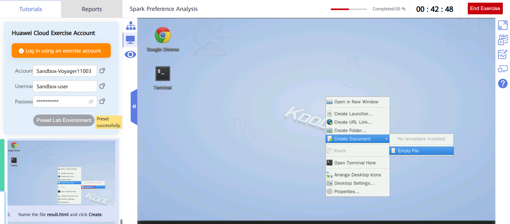

# Spark Preference Analysis
This exercise describes how to use Spark and the course information table to analyze the change trend of students' learning performance and learning styles.
## 1 Configuring the Lab Environment

### 1.1 Prerequisites: Logging In to Huawei Cloud
Go to the Exercise Interface and open the Chrome browser. The Huawei Cloud console can be automatically logged in for the first time.


## 2 Procedure
### 2.1 Logging In to the ECS Using SSH
Open Google Chrome, go to the ECS service list, and copy the ECS EIP.


Run the following command to log in to the ECS. Replace EIP in the command with the public IP address of the ECS.

```                                
ssh root@EIP
```

If this is your first time logging in to the system, a message is displayed. Enter yes.
You can obtain the password of user root to log in to the ECS. The following figure shows you how to get the password.


### 2.2 Starting the Hadoop Cluster

Perform the following steps to start the Hadoop cluster:
Switching to user zker
Run the following command to switch to user zker:

```                                
su - zker
```
                            
The following shows the command output.


View the files in the current directory of user zker.

```                          
ls
```                       

Starting Hadoop Run the following command:

```                             
./start-cluster.sh
```


                            
If the information shown in the following figure is displayed, the Hadoop cluster is started.


Run the following command:

```                                
jps
```


### 2.3 Installing the PyHDFS and the FindSpark Libraries

Switch to the root user. (If the current user is root, skip this step.)

```                                
su - root
```


Run the following command to install the PyHDFS library:

```                                
pip3 install pyhdfs
```


The correct execution result is shown in the red box in the following figure.
Perform the same operation to install the findspark library.

```                                
pip3 install findspark
```


### 2.4 Preparing Data
Prepare the data file, code file preference_analysis.py, and code of the visualization page result.html.

Switch to user zker.

```                            
su - zker
```
                            
Downloading the data file
Download and decompress the data file.

```       
wget https://sandbox-expriment-files.obs.cn-north-1.myhuaweicloud.com:443/20220930/exp16/data.zip                            
unzip data.zip
```
                            
Confirming the data file
The data files in Data are as follows:

```                                
cd data
```
```                             
ls
```


Take **7001.txt** as an example. The content of the first 20 lines in the file is as follows:

```               
7001,10.0,1243,6.80
7001,10.0,762,6.90
7001,10.0,529,7.70
7001,10.0,398,6.70
7001,10.0,338,8.20
7001,10.0,345,8.40
7001,10.0,312,6.90
7001,10.0,297,7.10
7001,20.0,295,14.10
7001,10.0,290,7.70
96001,5.0,9049,4.30
96001,5.0,8169,4.00
96001,5.0,7355,4.20
96001,5.0,7351,4.10
96001,5.0,7514,4.20
96001,5.0,7193,4.20
96001,5.0,5367,3.90
96001,5.0,5916,3.90
96001,5.0,5347,3.90
96001,5.0,5241,4.00
```
                            
The provided file comes from online teaching data and each line of the file indicates the data of a test. The record is separated into four parts by commas. The first part indicates the semester corresponding to the record, the second part indicates the full score, the third part indicates the number of students participating in the test, and the fourth part indicates the average score.

### 2.5 Procedure
In this exercise, the Python script program on the client is used to read HDFS files provided by MRS, MRS Spark is called to process and analyze these files, and then the data analysis result is displayed the console in a visualized manner.

#### 2.5.1 Uploading datasets to HDFS
Upload the data in the data directory to the HDFS root directory and run the ls command to view the data.

```                           
cd ..                             
hdfs dfs -put data /                           
hdfs dfs -ls /            
hdfs dfs -ls /data
```


#### 2.5.2 Running the Python-based data analysis program
Run the following command to use the Vim editor to create the preference_analysis.py file in the /home/zker directory:

```
vim preference_analysis.py
```
                            
Press i to enter editing mode and enter the following code:

```                             
import findspark
findspark.init()
from pyspark.sql import SparkSession
import pyhdfs
from pyspark.sql.types import IntegerType,DecimalType
# create sparkSession function
def createSparkSession(appName, exeMemory):
    return SparkSession.builder \
        .master("local[*]") \
        .appName(appName) \
        .config("spark.executor.memory", exeMemory) \
        .getOrCreate()
# file convert to RDD function
def transToRdd(sc,dirPath,sep):
    fs = pyhdfs.HdfsClient(hosts="192.168.0.159:9870",user_name="root")
    fileNames = sorted([filename for filename in fs.listdir(dirPath) if filename.endswith('.txt')])
    return sc.union([sc.textFile(dirPath + f) for f in fileNames]).map(lambda line: line.split(sep))

# get sparkSession
sparkSession = createSparkSession("test2","1gb")
# get sparkContext
sc = sparkSession.sparkContext
sc.setLogLevel("ERROR")
# modifiable parameter: user-defined data folder path
dirPath = "/data/"
# convert all files to rdd
rdd = transToRdd(sc,dirPath,",")
# convert rdd to dataFrame object
df = rdd.toDF(["termID","totalScore","number","averageScore"])
# change the data type of the filtered normal data for statistics
df = df.withColumn("totalScore",df["totalScore"].cast(DecimalType(scale=1)))\
    .withColumn("number",df["number"].cast(IntegerType()))\
    .withColumn("averageScore",df["averageScore"].cast(DecimalType(scale=2)))
df.describe().show()
# 20 records whose average value is greater than 1979 are displayed in the statistical data set
print("The record with high number of people(>1979):")
df.filter(df.number > 1979).show(20)
# output all test records with semester ID 372001
print("The record with typical termID(372001):")
df.filter(df.termID == 372001).show(100)
```


>[!Caution]
>Change the internal IP address in the original code.
>Change the value of hosts in the original code to the private IP address of the ECS, that is, change 192.168.0.159 to the content shown in the figure.

Run the following command to execute the python file:

```                                
python3 ./preference_analysis.py
```


The following figure shows the command output.

>[!Note]
>The analysis result shows the main features of the dataset and then selects a group of representative test data based on Spark DataFrame. 
>As you can see, the dataset contains 329 test data records, and each data record has four dimensions (described above).
>The average number of participants in the test (1979) is displayed in the result after the describe() function is used to quickly view data features, and there are 20 pieces of data are greater than the mean value. 
>Then the result shows that the number of participants in the same course during the semester whose ID is 372001 is large and their test scores fluctuate slightly. 
>After further statistics, all test scores in the semester were printed. 
>It can be found that the test scores fluctuated slightly at the beginning of the semester and became stable at the end of the semester.

#### 2.5.3 Visualizing the analysis result
Highcharts is used for data visualization to facilitate viewing of data analysis results, and the code needs to be interpreted and rendered by the browser. The visualization code for displaying the data result is omitted here due to limited space, and the specific file has been provided in result.html.

##### 1. Right-click on the desktop, choose Create Document, and then select Empty File.



##### 2. Name the file result.html and click Create.


##### 3. Paste the content in the appendix to the result.html file. Use the following method to create a terminal:

```                               
ls
cd Desktop/
ls
```
```
vim result.html
```                         
Paste the **result.html** code.

*result.html code:*

```                
<!DOCTYPE HTML>
<html>
<head>
 <meta charset="utf-8">
<link rel="icon" href="https://jscdn.com.cn/highcharts/images/favicon.ico"> <script src="http://code.highcharts.com/highcharts.js"></script>
</head>
<body>
 <div id="container" style="min-width:400px;height:400px"></div>
 <script>
 var chart = Highcharts.chart('container', {
 chart: {
  zoomType: 'xy'
 },
 title: {
  text: 'Test Scores and Participant Trends',
  align:'left'
 },
 xAxis: [{
  categories: ['1st Quiz', '2nd Quiz', '3rd Quiz', '4th Quiz', '5th Quiz', '6th Quiz', '7th Quiz', '8th Quiz','9th Quiz','10th Quiz','11th Quiz','12th Quiz'],
  crosshair: true
 }],
 yAxis: [{ // Primary yAxis
  labels: {
   format: '{value}',
   style: {
    color: Highcharts.getOptions().colors[1]
   }
  },
  title: {
   text: 'Ratio',
   style: {
    color: Highcharts.getOptions().colors[1]
   }
  }
 }, { // Secondary yAxis
  title: {
   text: 'number of people',
   style: {
    color: Highcharts.getOptions().colors[0]
   }
  },
  labels: {
   format: '{value} people',
   style: {
    color: Highcharts.getOptions().colors[0]
   }
  },
  opposite: true
 }],
 tooltip: {
  shared: true
 },
 legend: {
  align: 'center',
  verticalAlign: 'top',
  floating: true,
  backgroundColor: (Highcharts.theme && Highcharts.theme.legendBackgroundColor) || '#FFFFFF'
 },
 plotOptions: {
  bar: {
   dataLabels: {
    enabled: true,
   }
  }
 },
 series: [{
  name: 'Number of people in the test',
  type: 'column',
  yAxis: 1,
  data: [13552,12913,12854,12606,7273,7237,12531,12228,12021,11960,11793,9217],
  tooltip: {
   valueSuffix: ' mm'
  }
 }, {
  name: 'Average Test Score/Total Score',
  type: 'spline',
  data: [5.8/6,5.9/6,6.8/7,6.9/7,7.2/8,7.1/8,8.8/9,5.9/6,5.9/6,5.9/6,5.9/6,23.2/30],
 }]
});</script>
</body>
</html>
```


##### 4. Double-click result.html. The data visualization result is shown in the following figure.
##### 5. Copy the link from the Chrome browser and paste it to the Google Chrome browser. On the Google Chrome browser, refresh the detection conditions for several times before the link turns green. (Skip this step if Google Chrome is used.)


>[!Note]
>In the figure, the column indicates the number of participants in each test, and the curve indicates the ratio of the average score to the total score in each test (ignoring the impact of the total score difference). 
>A total of 12 tests were conducted during the semester (the last one was the final test), represented by the x axis. 
>Y axis on the right represents the number of people in the test and y axis on the left represents the average test score/total score. 
>When you click a bar or curve, the chart displays two vertical reference lines to assist in reading.

>As you can see, the average score of the test fluctuated in the first half of the semester, and even the score and the number of participants fell sharply in the middle of the semester. 
>This may be due to the increasing difficulty of preparatory knowledge in the middle of the course, which lowers students' enthusiasm for learning.

