# Setting Up a Kafka Cluster

This experiment describes how to set up and use a Kafka cluster. In this experiment, you can create a DMS instance of the Kafka and simulate message production and consumption in command line mode.

## 1: Resource Preparation

Go to the Exercise Interface and open the Chrome browser.


Select IAM User. In the login dialog box, enter the Huawei Cloud lab account and password allocated by the system to log in to Huawei Cloud, as shown in the following figure.

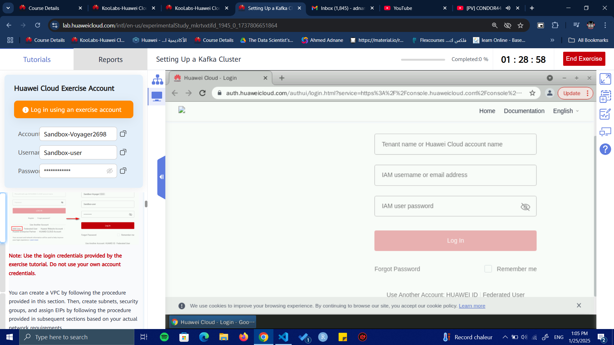

### Create a VPC
>[!Note]
>What Is Virtual Private Cloud?
>A VPC provides an isolated virtual network for ECSs. You can configure and >manage the network as required.

1. On the Huawei Cloud console page, Click Virtual Private Cloud. The VPC console page is displayed.
2. Click Create VPC.
3. On the Create VPC page, set parameters as prompted.

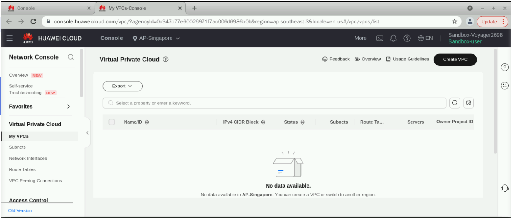

(1) *VPC Name*: **vpc-kafka**

(2) *Subnet Name*: **subnet-kafka**

Retain the default values for other parameters. A default subnet will be created together with a VPC and you can also click Add Subnet to create more subnets for the VPC.

4. Click Create Now.

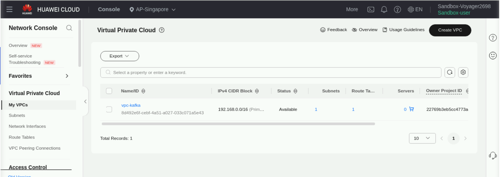

>[!Note]
>What is security group?
>A security group is a collection of access control rules for cloud resources, such as cloud servers, containers, and databases, that have the same security protection requirements and that are mutually trusted.
>After a security group is created, you can create various access rules for the security group, these rules will apply to all cloud resources added to this security group.

Create a Security Group
1. In the navigation pane on the left, choose Access Control > Security Groups.

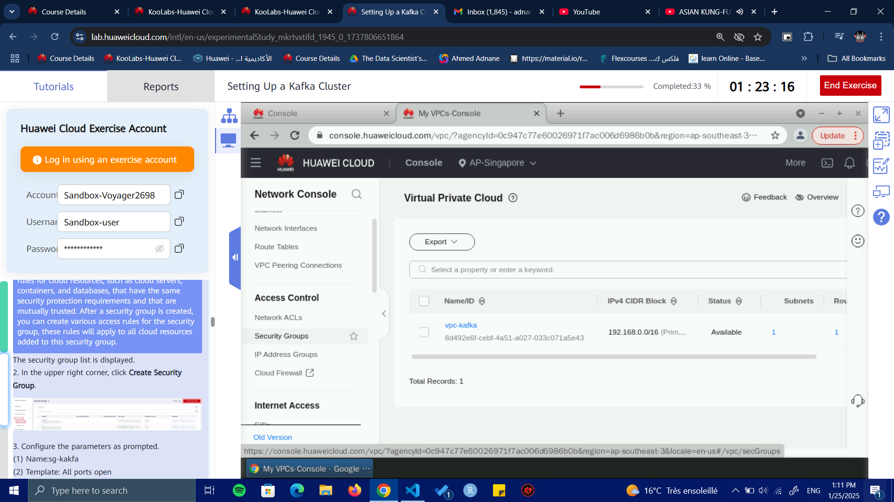

2. In the upper right corner, click Create Security Group.
3. Configure the parameters as prompted.

(1) *Name*: *sg-kakfa*
(2) *Template*: **All ports open**

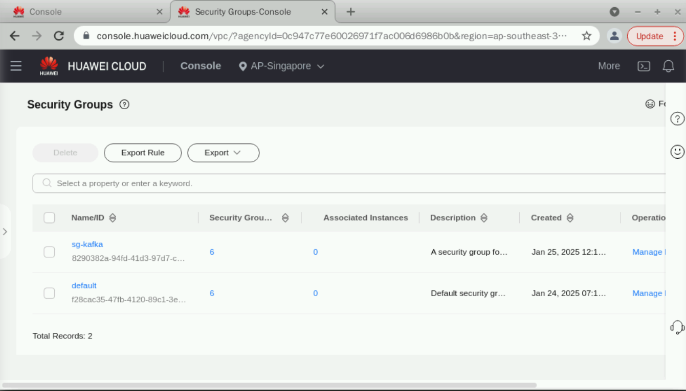

### Purchase an ECS

>[!Note] What is Elastic Cloud Server?
>Elastic Cloud Server (ECS) is a cloud server that provides scalable, on-demand computing resources for secure, flexible, and efficient applications.

1. Move the cursor to the *menu bar*, and choose *Service List > Compute > Elastic Cloud Server*.

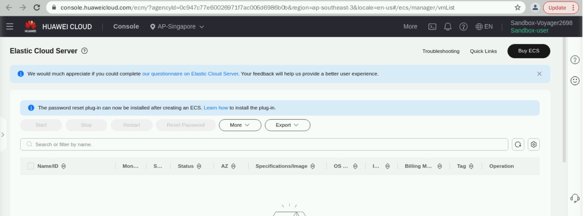

2. Click Buy ECS and configure parameters as follows.
(1) *Region*: **AP-Singapore**
(2) *Billing Mode*: **Pay-per-use**
(3) *AZ*: **Random**

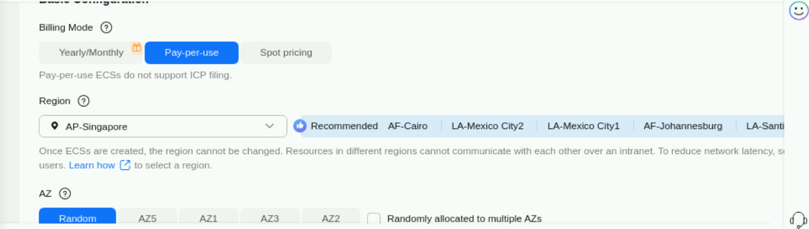

(4) *CPU Architecture*: **x86**

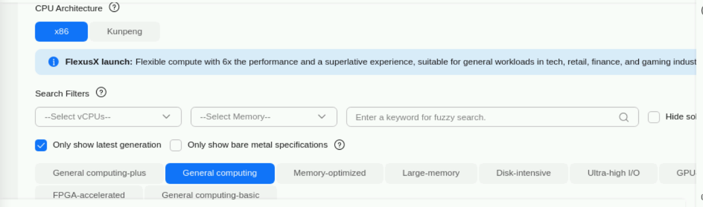

(5) *Specifications*: **General computing | s6.large.2 | 2 vCPUs | 4 GiB**

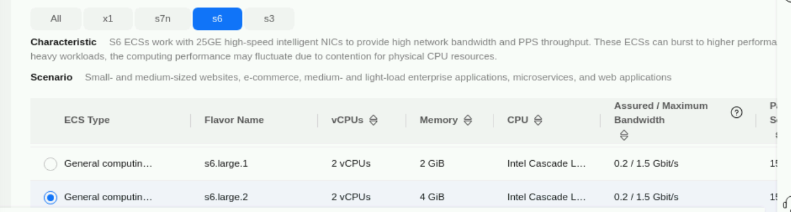

(6) *Image*: *Public image, Huawei Cloud EulerOS, and Huawei Cloud EulerOS 2.0 Standard 64bit(40GB)*
(7) *Protection*: **None**


(8) *System Disk*: **General Purpose SSD and 40 GiB IOPS limit**

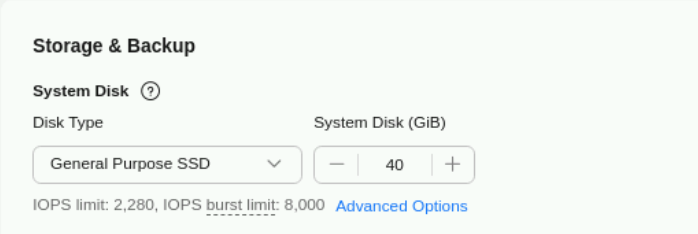

Click **Next**: Configure Network and configure parameters as follows.

(1) *Network*: **vpc-kafka**
(2) *Extension NIC*: **Retain the default value**

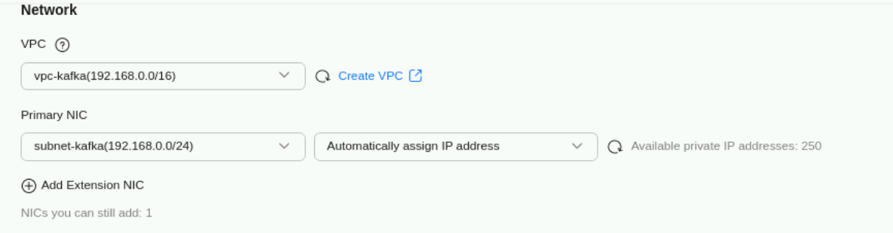

(3) *Security Group*: **sg-kafka**

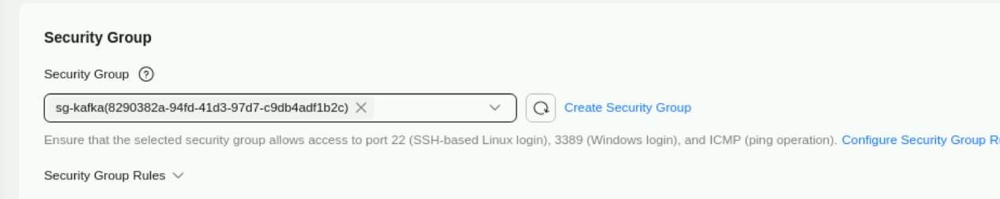

(4) *EIP*: **Auto assign**
(5) *EIP Type*: **Dynamic BGP**
(6) *Billed By*: **Bandwidth**

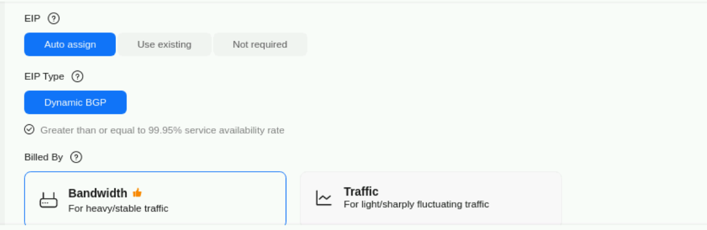

(7) *Bandwidth Size*: *1 Mbits/s*
(8) *Release Option*: **Release with ECS**

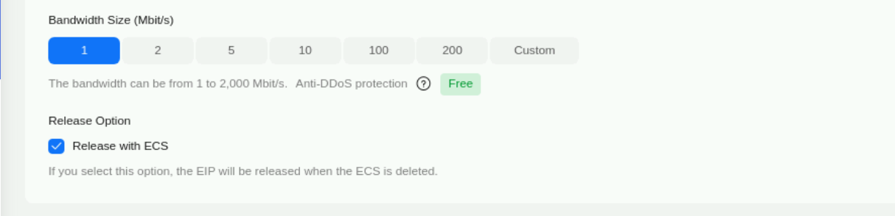

Click Next: Configure Advanced Settings and configure parameters as follows.

(1) *ECS Name*: **ecs-kafka**.
(2) *Login Mode*: **Password**
(3) *Username*: **root**
(4) *Password*: **Customize the name, for example,Huawei@1234**
(5) *Cloud Backup and Recovery*: **Not required**
(6) *Retain the default values for other parameters.*

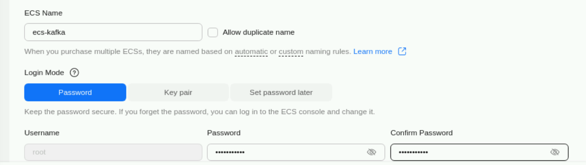

Click Next: Confirm and configure parameters as follows.

(1) *Quantity*: **1**
(2) Select I have read and agree to the Service Level Agreement and Image Disclaimer.

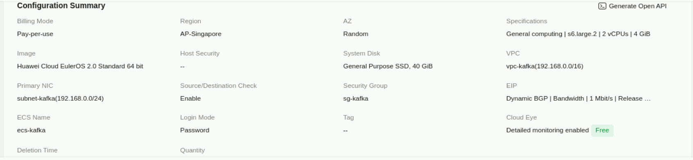

If need to set an Enterprise Project, select Default. Click Submit.

Click Back to ECS List.
The ECS will be displayed.

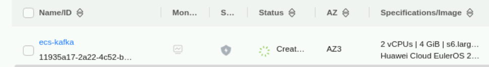

### Install the OpenJDK
1. Click Remote Login.
Click Log In in CloudShell-based Login.

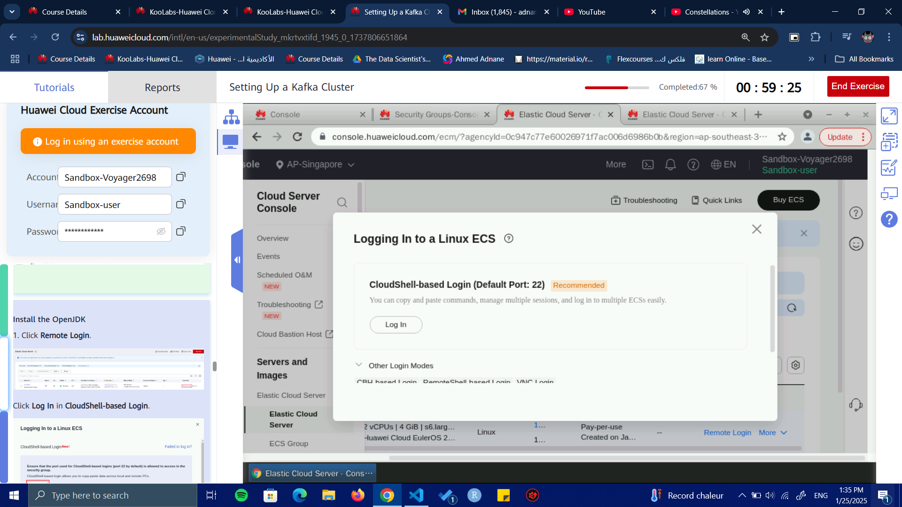

2. Input password and click Connect, log in to the ECS.

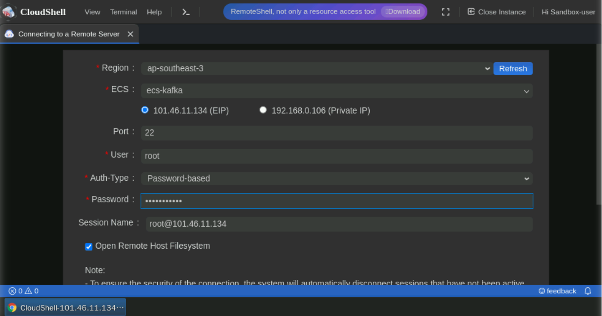

3. Run the following command to install the OpenJDK tool:

```
yum install -y java-1.8.0-openjdk java-1.8.0-openjdk-devel
```                      

After the running is complete, the message **"Complete!"** is displayed.

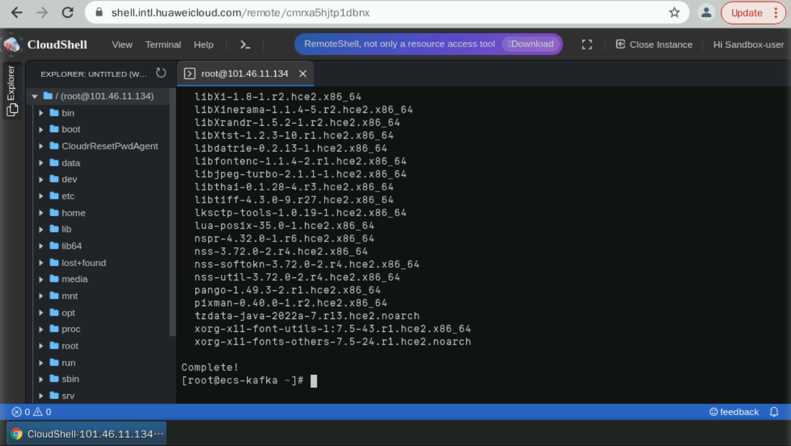

4. Type the following command to verify the Java environment:

```
java -version
```                        
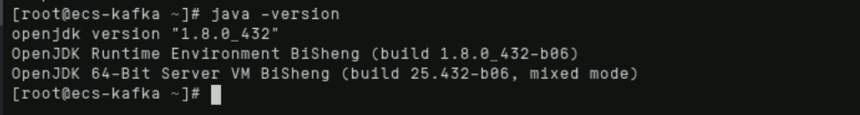

Download an open-source Kafka client
1. Run the following command to obtain the Kafka command line tool package:

```                                
wget https://sandbox-expriment-files.obs.cn-north-1.myhuaweicloud.com:443/20220924/kafka_2.11-2.3.0.tgz
```

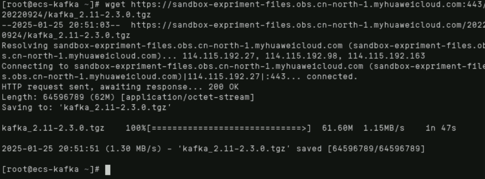

2. After the download is complete, run the following command to decompress the package:

```                                
tar -zxvf kafka_2.11-2.3.0.tgz
```

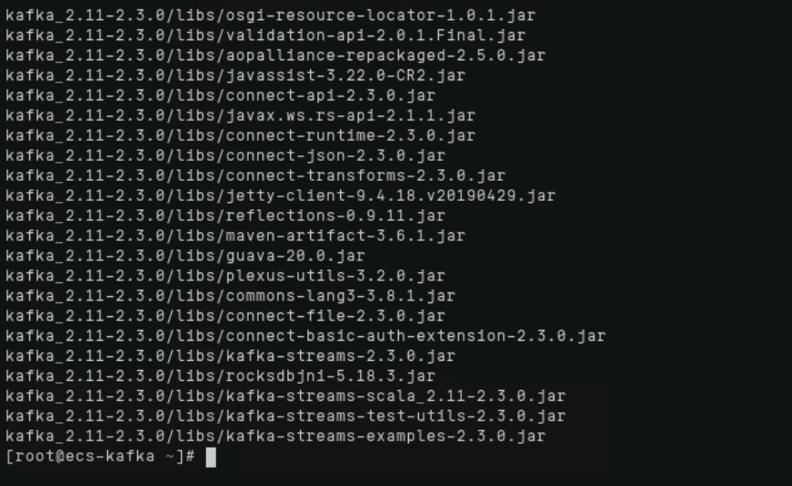

## 2: Create a Kafka Instance

1. Return to the HUAWEI CLOUD console page，move the cursor to the menu bar, and choose Service List > Middleware > Distributed Message Service(for kafka), as shown in the following figure.

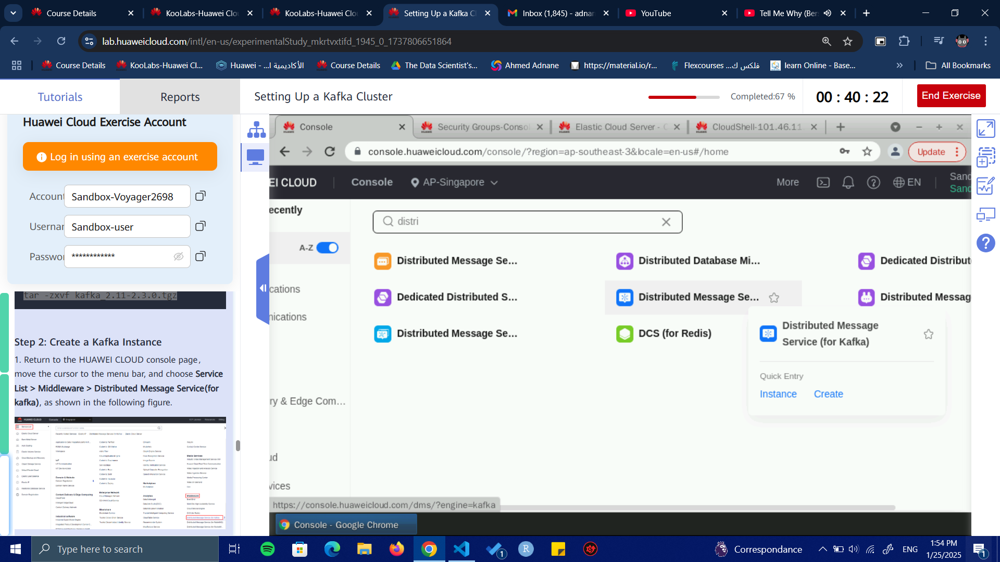

click Buy Instance,

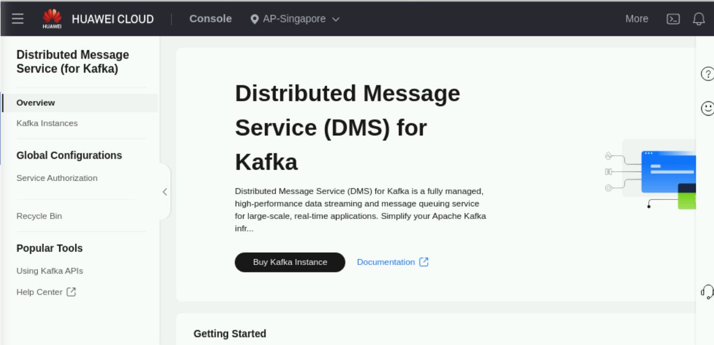

2. configure the parameters as prompted.

(1) *Billing Mode*: **Pay-per-use**
(2) *Region*: **AP-Singapore**
(3) *Project*: **AP-Singapore(default)**
(4) Select **one AZ** or **at least three AZs**.

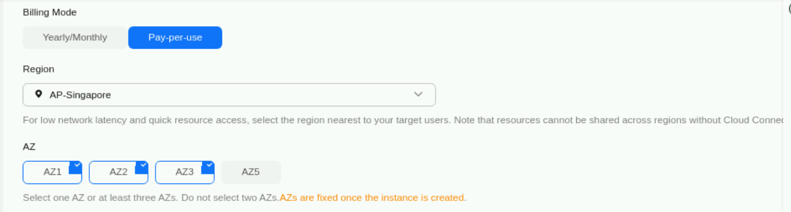

(5) *Instance name*: **kafka-demo**.

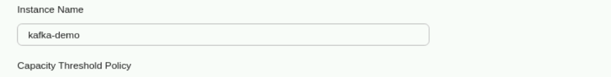

(6) *Broker Flavor*: **kafka.2u4g.cluster**

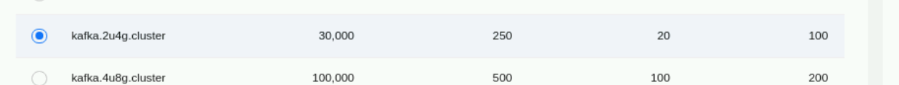

(7) *Brokers*: **3**


(8) *VPC*: **vpc-kafka**
(9) *Security Group*: **sg-kafka**

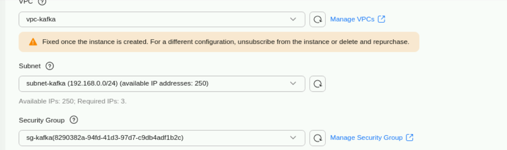

(10) *Kafka SASL_SSL*: **Disenable(Ignore this parameter if it does not exist.)**

Click **Advanced Settings**.

(11) *Public Access（or Public NetWork Access）*: **Enabled**
     *Plaintext Access*: **Enabled**
     *Public IP Addresses*: **Select three public IP addresses from the Elastic IP Address drop-down list**.
     If **no EIP is created**, *click Create Elastic* **IP(Pay-per-use,Bandwidth 1Mbit/s,Quantity:3).** .

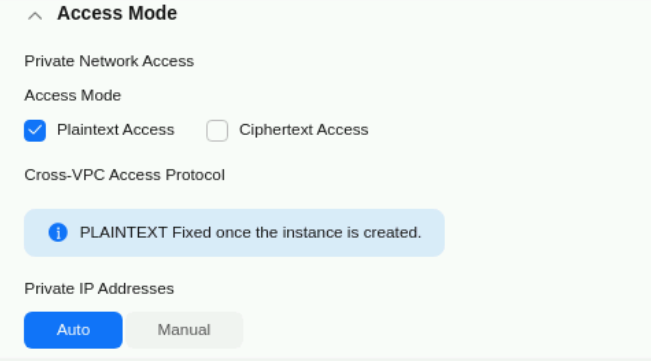

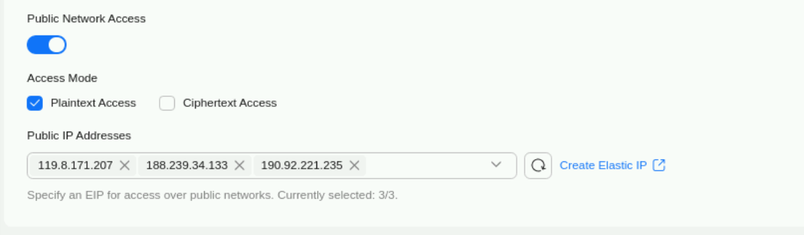

(12) *Automatic Topic Creation*: **Enabled**.


3. Confirm the instance information.
Select I have read and agree to the HUAWEI CLOUD Customer Agreement, click submit.

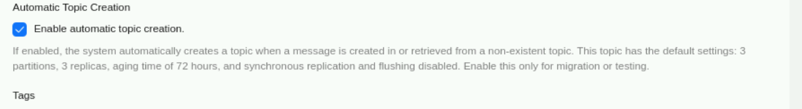

4. Return to the instance list and check whether the instance has been created.
It takes 3 to 15 minutes to create an instance. During this period, the instance status is Creating.

If the instance is created successfully, its status changes to Running.

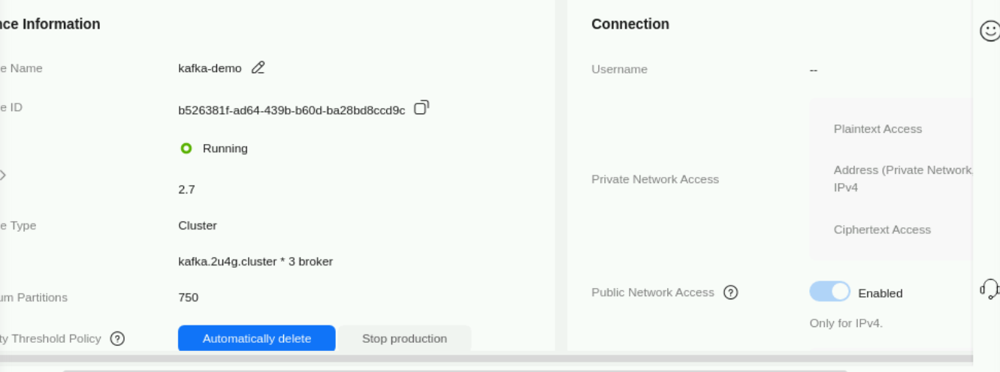

>[!Note]
>Here is the public and private addresses of the instances.
>
>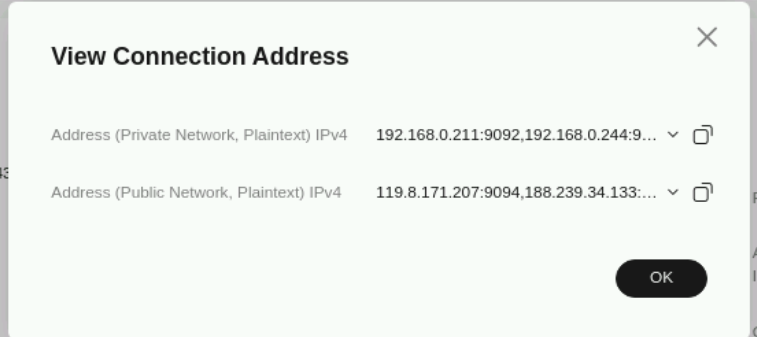
>

## 3: Use the Command Line Tool to Produce and Consume Messages

### Production message
1. Return to *the Kafka console page* and click **the instance name(kafka-demo)** to go to the instance details page.
2. On *the Basic Information page*, **click the copy icon in the Connection information area to copy the Public Access(Address)**.
3. Run the following command to go to the /bin directory of the Kafka command line tool:

```                           
cd ./kafka_2.11-2.3.0/bin
```

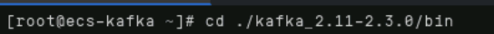

4. Run the following command to produce messages:
Replace the **${Connection Address}** with the Public Access Address of the Kafka instance.in the following sections.

```
sh kafka-console-producer.sh --broker-list ${Connection Address} --topic topic-test
```

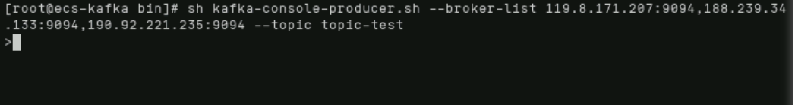

The following information ***indicates that the Kafka cluster has been connected***.

>[!Tip]
>Input: Hello.
>This message must be produced for testing in the experiment procedure.

Press Enter to generate a message. The process takes several minutes.

If the symbol **(>)** appears again, it indicates that the message **is generated successfully**. In this case, you can continue to enter any message content for production.

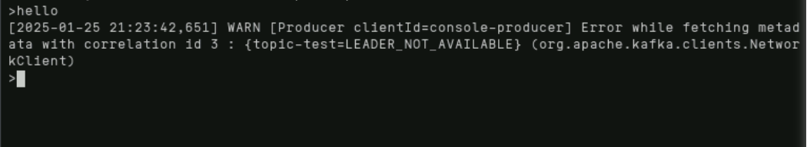

>[!Note]
>In the lab, the required topic is not created in advance. Instead, the automatic topic creation function of DMS is used. Therefore, a WARN log is printed when the first message is generated, which can be ignored.

To stop the production process, press ``` Ctrl+C ``` .

5. Go back to the Kafka instance page and click Message Query in the left navigation pane. The Message Query page is displayed. Select topic-test from the Topic Name drop-down list box and click Search, you can see the message that has been produced.

Click **View Message** Body to view the message content.

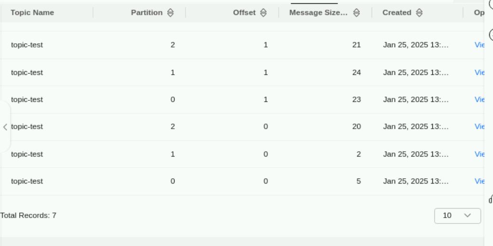

Example message:

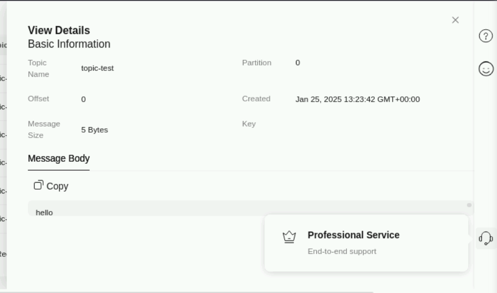

### Message consumption
1. Run the following command to consume messages:

Replace the **${Connection Address}** with the **Public Access Address of the Kafka instance**.in the following sections.

```                     
sh kafka-console-consumer.sh --bootstrap-server ${Connection Address} --topic topic-test --group group-test --from-beginning
```

During the execution, messages are consumed and the message body is printed. You can press Ctrl+C to exit the consumption process.

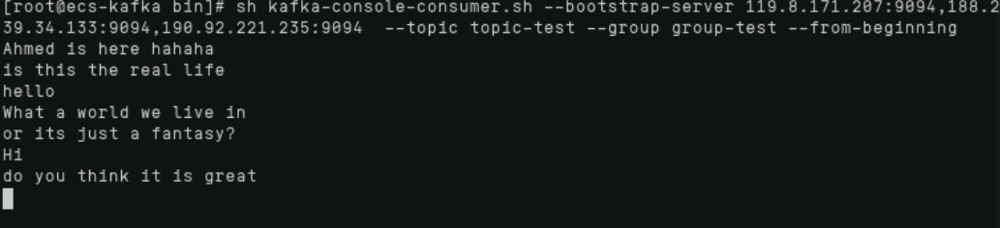

2. The experiment command specifies a consumer group named group-test. Go back to the Kafka instance page and click Consumer Groups in the left navigation pane. The consumer group named group-test is displayed.

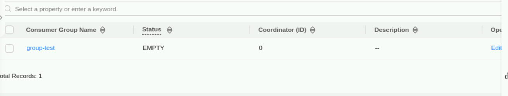